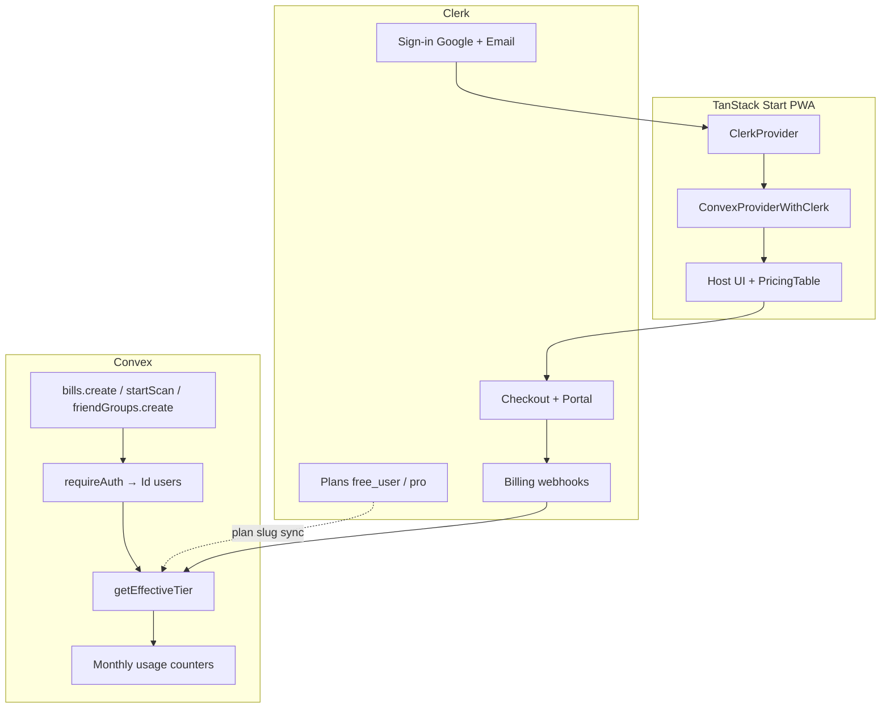

# Clerk auth + Billing — implementation spec

> **Billing half superseded.** Host Pro is **Stripe Billing**, not Clerk Billing — [ADR 0003](../adr/0003-stripe-billing-beside-clerk.md). The **Clerk auth** sections below still describe the shipped sign-in stack ([ADR 0002](../adr/0002-clerk-auth-billing.md)). Do not implement `<PricingTable />`, Clerk Plans, or Clerk subscription webhooks from this spec.

Wayfinder map [#103](https://github.com/HayGrouve/onova-za-smetkata/issues/103). Resolves task [#113](https://github.com/HayGrouve/onova-za-smetkata/issues/113).

**Status:** Historical for Clerk Billing. Auth parts remain useful. New Host Pro work follows ADR 0003.

**Scope:** Host authentication + SaaS subscription only. Guest join/claim (share tokens, `guestSessions`) unchanged.

---

## Locked product decisions

| Decision         | Value                                                                          | Ticket   |
| ---------------- | ------------------------------------------------------------------------------ | -------- |
| Stack            | **Clerk auth + Stripe Billing** (Clerk Billing withdrawn — ADR 0003)           | —        |
| Tiers            | **Free + Pro**                                                                 | #107     |
| Free limits      | 5 bills/mo, 5 OCR/mo, 1 friend group (20 members max)                          | #107     |
| Pro limits       | Unlimited bills/OCR, 50 friend groups                                          | #107     |
| Pro price        | **€2.99/mo**, monthly only, no trial/discount                                  | #111     |
| At quota         | Soft block — existing bills editable; only new creates/scans blocked           | #107     |
| Payment failed   | 7-day grace, keep Pro; downgrade after grace                                   | #112     |
| Voluntary cancel | Pro until `current_period_end`                                                 | #112     |
| Post-downgrade   | Counters carry over; no read-only mode                                         | #112     |
| Pre-public       | Few test users — **wipe or fresh start** acceptable; no prod migration runbook | #108     |
| Quota engine     | **Convex authoritative**; Stripe subscription state mirrored into Convex       | ADR 0003 |

---

## Architecture



**Split of responsibility**

| Layer  | Owns                                                                                                                                     |
| ------ | ---------------------------------------------------------------------------------------------------------------------------------------- |
| Clerk  | Sign-in UI, user profile, checkout, subscription lifecycle, boolean plan/feature claims (`pla`, `fea`)                                   |
| Convex | `users` row + `clerkSubject` mapping, plan mirror + grace fields, **monthly bill/OCR counters**, mutation enforcement, burst rate limits |

---

## Phase 0 — Clerk Dashboard (dev instance first)

1. Create Clerk application (separate **dev** / **prod** instances).
2. Enable sign-in: **Google**, **Email** (magic link or code).
3. Localization: **`bgBG`** on Clerk components ([localization guide](https://clerk.com/docs/guides/customizing-clerk/localization)).
4. JWT template **`convex`**: standard claims; Convex validates with `applicationID: 'convex'`.
5. Enable **Billing → Plans for Users (B2C)**:
   - Keep default **`free_user`** plan (auto-assigned).
   - Create **`pro`** plan: **€2.99/month**, EUR.
6. Optional features on plans (boolean gates for UI only; quotas still in Convex):
   - `ocr` — attach to `pro` (optional UX gate on scan button).
   - `friend_groups` — attach to `pro` for >1 group (Convex enforces count either way).
7. Connect Stripe (prod only; dev uses Clerk shared test gateway).
8. Webhook endpoint → Convex HTTP route (see [Webhooks](#webhooks)).
9. Copy **Frontend API URL** → `CLERK_JWT_ISSUER_DOMAIN` on Convex.

---

## Phase 1 — Auth migration

Detail: `research/clerk-convex-migration-surface.md`.

### Packages

| Remove                           | Add                           |
| -------------------------------- | ----------------------------- |
| `@convex-dev/auth`, `@auth/core` | `@clerk/tanstack-react-start` |

`convex/react-clerk` ships with `convex`.

### Schema (`convex/schema.ts`)

```typescript
users: defineTable({
  clerkSubject: v.string(),
  name: v.optional(v.string()),
  image: v.optional(v.string()),
  email: v.optional(v.string()),
  username: v.optional(v.string()),
  // Billing mirror (synced from Clerk webhooks)
  clerkPlanSlug: v.optional(v.string()), // 'free_user' | 'pro'
  subscriptionStatus: v.optional(v.string()), // 'active' | 'past_due' | 'canceled' | …
  currentPeriodEnd: v.optional(v.number()), // ms epoch
  graceUntil: v.optional(v.number()), // ms epoch — past_due grace end
})
  .index('by_clerkSubject', ['clerkSubject'])
  .index('email', ['email'])
```

- **Remove** `...authTables` after cutover.
- Pre-public: **truncate test data** or deploy fresh Convex dev deployment rather than email-link migration.

### `convex/lib/auth.ts`

Replace `getAuthUserId` with Clerk identity → upsert/lookup by `clerkSubject`:

```typescript
export async function requireAuth(ctx): Promise<Id<'users'>> {
  const identity = await ctx.auth.getUserIdentity()
  if (!identity?.subject) throw new ConvexError('Изисква се вход')

  const existing = await ctx.db
    .query('users')
    .withIndex('by_clerkSubject', (q) => q.eq('clerkSubject', identity.subject))
    .unique()
  if (existing) return existing._id

  return await ctx.db.insert('users', {
    clerkSubject: identity.subject,
    email: identity.email,
    name: identity.name,
    image: identity.pictureUrl,
    clerkPlanSlug: 'free_user',
  })
}
```

All existing `requireAuth` / `requireBillOwner` call sites stay unchanged — they still receive `Id<'users'>`.

### Client provider stack

Replace in `src/integrations/convex/provider.tsx`:

```tsx
ClerkProvider → ConvexProviderWithClerk → ConvexQueryClient wiring
```

Add TanStack Start `createStart` + `clerkMiddleware()` (new entry file per project convention).

### Client auth touchpoints

| File                                        | Change                                                     |
| ------------------------------------------- | ---------------------------------------------------------- |
| `src/routes/login.tsx`                      | Clerk `<SignIn />`; preserve guest copy + `redirect` param |
| `src/hooks/use-require-host-auth.ts`        | Clerk `useAuth()` — `isLoaded`, `isSignedIn`               |
| `src/components/layout/app-header-menu.tsx` | `<SignOutButton />` or `useClerk().signOut()`              |
| 6× `useConvexAuth` consumers                | Map to Clerk `useAuth` / `useUser`                         |
| `src/components/auth/dev-auto-sign-in.tsx`  | **Delete**                                                 |

### Delete

- `convex/auth.ts`, `convex/lib/magicLinkEmail.ts`
- `auth.addHttpRoutes(http)` from `convex/http.ts`
- Resend / Google OAuth / JWT env vars (see [Environment](#environment))

### ADR

Supersede [ADR 0001](../adr/0001-google-oauth-branding.md) — Google OAuth moves to Clerk dashboard.

---

## Phase 2 — Quota enforcement

New module: **`convex/lib/hostTier.ts`**.

### Tier config (constants)

```typescript
export const FREE_BILLS_PER_MONTH = 5
export const FREE_OCR_PER_MONTH = 5
export const FREE_FRIEND_GROUPS = 1
export const PRO_FRIEND_GROUPS = 50
export const PAST_DUE_GRACE_MS = 7 * 24 * 60 * 60 * 1000
```

### `getEffectiveTier(user)`

Returns `'free' | 'pro'`:

| Condition                                                                                                  | Tier            |
| ---------------------------------------------------------------------------------------------------------- | --------------- |
| `clerkPlanSlug === 'pro'` AND (`subscriptionStatus === 'active'` OR within `currentPeriodEnd` on canceled) | **pro**         |
| `subscriptionStatus === 'past_due'` AND `now < graceUntil`                                                 | **pro** (grace) |
| Otherwise                                                                                                  | **free**        |

### Monthly counters

Reuse `rateLimitBuckets` pattern or dedicated `usageCounters` table. Keys:

- `usage:{userId}:bills:{yyyy-mm}`
- `usage:{userId}:ocr:{yyyy-mm}`

Calendar month boundary (UTC or `Europe/Sofia` — pick one, document in code).

### Guard points

| Mutation                | Checks                                                                           |
| ----------------------- | -------------------------------------------------------------------------------- |
| `bills.create`          | `getEffectiveTier`; if free, count bills this month < 5                          |
| `receiptScan.startScan` | tier + OCR count < 5 if free; then existing `assertRateLimit` (10/hour per bill) |
| `friendGroups.create`   | if free, existing group count < 1; if pro, count < 50                            |

Existing bills, groups, edits: **always allowed** (soft block).

### Error codes + Bulgarian copy

Throw `ConvexError` with stable codes for client paywall routing:

| Code           | User message (bg)                                                                   |
| -------------- | ----------------------------------------------------------------------------------- |
| `QUOTA_BILLS`  | „Достигнахте лимита от 5 сметки за този месец. Надградете до Pro за €2.99/мес.“     |
| `QUOTA_OCR`    | „Достигнахте лимита от 5 сканирания за този месец. Надградете до Pro за €2.99/мес.“ |
| `QUOTA_GROUPS` | „Безплатният план позволява 1 група. Надградете до Pro за €2.99/мес.“               |

Shared module: `shared/subscription-messages.ts` (or extend existing message modules).

### Viewer query

`users.viewer` (or new `subscriptions.getMyUsage`) exposes:

```typescript
{
  tier: 'free' | 'pro',
  billsUsedThisMonth: number,
  billsLimit: number | null,  // null = unlimited
  ocrUsedThisMonth: number,
  ocrLimit: number | null,
  friendGroupCount: number,
  friendGroupLimit: number,
  subscriptionStatus?: string,
  graceUntil?: number,
}
```

---

## Phase 3 — Billing UI

### Placement

| Surface             | Component                                                                                                     |
| ------------------- | ------------------------------------------------------------------------------------------------------------- |
| Profile sheet       | `<SubscriptionDetailsButton />` — manage/cancel subscription                                                  |
| Quota paywall modal | Custom modal with `<PricingTable />` or `clerk.billing.startCheckout({ planId: 'pro', planPeriod: 'month' })` |
| Post-limit CTA      | Same paywall when mutation returns `QUOTA_*`                                                                  |

Hide OCR button / „Нова група“ with Clerk `<Show when={{ plan: 'pro' }}>` for UX — **mutations still enforce**.

### Clerk plan slugs

| Slug        | Price    | Convex tier |
| ----------- | -------- | ----------- |
| `free_user` | €0       | free        |
| `pro`       | €2.99/mo | pro         |

---

## Webhooks

Add to `convex/http.ts`:

| Clerk event                       | Convex action                                                                  |
| --------------------------------- | ------------------------------------------------------------------------------ |
| `subscriptionItem.active`         | Set `clerkPlanSlug: 'pro'`, `subscriptionStatus: 'active'`, `currentPeriodEnd` |
| `subscriptionItem.canceled`       | Keep `pro` until `currentPeriodEnd`; set status `canceled`                     |
| `subscriptionItem.pastDue`        | Set `past_due`, `graceUntil: now + 7d`                                         |
| `subscription.updated` (inactive) | Downgrade to `free_user`, clear grace                                          |

Verify webhook signature with Clerk signing secret. Idempotency: store processed event IDs.

Payload: payer at `evt.data.payer.user_id` → lookup `users.by_clerkSubject`.

---

## Phase 4 — Dev / E2E

Replace Password provider + `DevAutoSignIn` with **[Clerk Testing Tokens](https://clerk.com/docs/testing/overview)**.

### E2E changes (`e2e/helpers/host-auth.ts`)

1. Remove `DEV_MODE` prerequisite from `E2E_HOST_AUTH_MESSAGE`.
2. Add `CLERK_SECRET_KEY` + `@clerk/testing` setup in Playwright `globalSetup` or fixture.
3. `openHostContext`: inject testing token → navigate → expect „Нова сметка“.
4. Update `e2e/README.md` and `.cursor/rules/e2e.mdc`.

### `DEV_MODE`

Remove auth meaning from `convex/lib/devMode.ts`. Repurpose only for non-auth dev flags if needed — **no auth bypass in prod-like paths**.

---

## Phase 5 — Pre-public cutover

App is not public; only a few test users (#108).

**Recommended:** Fresh Convex dev deployment + wipe Vercel preview data, or one-time script:

1. Deploy Clerk + Convex auth config to dev.
2. Truncate `users`, `bills`, … (or new deployment).
3. Re-seed E2E test host via Clerk test user.
4. Validate host flows + guest flows (unchanged).
5. Prod cutover when ready: same steps on prod deployment.

No email-link migration runbook required.

---

## Build sequencing

| Step | Workstream                                                                                | Size |
| ---- | ----------------------------------------------------------------------------------------- | ---- |
| 1    | Clerk dev instance + env vars                                                             | S    |
| 2    | Provider wiring + `auth.config.ts` + `requireAuth` upsert                                 | S–M  |
| 3    | E2E spike (Testing Tokens) **before** deleting Password provider                          | M    |
| 4    | Remove `@convex-dev/auth`, login page → Clerk                                             | S    |
| 5    | Clerk Billing plans + webhook route + `hostTier.ts`                                       | M    |
| 6    | Paywall UI + `viewer` usage query                                                         | S–M  |
| 7    | Docs: `DEPLOY.md`, retire `docs/google-oauth-setup.md`, update `.cursor/rules/convex.mdc` | S    |

**Overall: M** (pre-public, no prod migration).

---

## Environment

### Convex Dashboard

| Variable                       | Purpose                          |
| ------------------------------ | -------------------------------- |
| `CLERK_JWT_ISSUER_DOMAIN`      | JWT validation                   |
| `CLERK_WEBHOOK_SIGNING_SECRET` | Billing webhook verification     |
| `CLERK_SECRET_KEY`             | Optional: webhook reconciliation |

### Vercel / `.env.local`

| Variable                     | Purpose           |
| ---------------------------- | ----------------- |
| `VITE_CLERK_PUBLISHABLE_KEY` | Client            |
| `CLERK_SECRET_KEY`           | Server middleware |

### Remove

`JWT_PRIVATE_KEY`, `JWKS`, `SITE_URL`, `AUTH_GOOGLE_*`, `AUTH_RESEND_*`, `DEV_MODE` (auth).

---

## i18n integration

Parallel track ([#110](https://github.com/HayGrouve/onova-za-smetkata/issues/110)): wire `ClerkProvider` `localization` to Paraglide locale (`bgBG` / `enUS`). Quota paywall messages use Paraglide `m.*()`, not hardcoded strings. Detail: `docs/specs/i18n-implementation.md`.

## Out of scope (this spec)

- Guest payment collection (Revolut) — bill settlement, not SaaS
- Annual billing plan
- Free trial / launch discount
- Read-only mode on lapse
- Usage-based Clerk Billing (roadmap only)

---

## References

| Doc                                                                | Content                           |
| ------------------------------------------------------------------ | --------------------------------- |
| `research/clerk-convex-migration-surface.md`                       | File-by-file auth checklist       |
| `research/clerk-billing-quotas.md`                                 | Clerk vs Convex enforcement split |
| `research/auth-billing-alternatives.md`                            | Stack comparison (decision: A)    |
| [#107](https://github.com/HayGrouve/onova-za-smetkata/issues/107)  | Tier limits                       |
| [#111](https://github.com/HayGrouve/onova-za-smetkata/issues/111)  | Pricing                           |
| [#112](https://github.com/HayGrouve/onova-za-smetkata/issues/112)  | Lapsed subscription               |
| [Convex Clerk auth](https://docs.convex.dev/auth/clerk)            | Official integration              |
| [Clerk B2C billing](https://clerk.com/docs/guides/billing/for-b2c) | Plans + PricingTable              |
