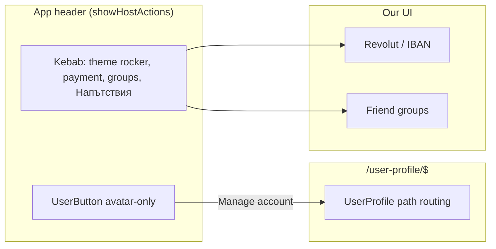

# Host account UI — implementation spec

Wayfinder map [#138](https://github.com/HayGrouve/onova-za-smetkata/issues/138). Resolves [#143](https://github.com/HayGrouve/onova-za-smetkata/issues/143).

**Status:** Locked for implementation. This spec is the hand-off; it does not implement the UI.

**Scope:** Hosts manage **Host account** through Clerk **UserButton** plus an in-app **UserProfile** route. Payment collection, friend groups, theme, and Напътствия stay in our kebab. There is no product **Host profile**. Clerk Billing stays off. Host Pro stays Stripe ([ADR 0003](../adr/0003-stripe-billing-beside-clerk.md)).

**Kebab / naming supersede:** [`kebab-chrome-after-clerk.md`](./kebab-chrome-after-clerk.md) (map [Host kebab chrome after Clerk](https://github.com/HayGrouve/onova-za-smetkata/issues/149)) — no **Профил** sheet, no kebab **Изход**, no viewer label, Auth name else **домакин**.

Research (working tree; commit with the implementation PR if still untracked):

- [`research/clerk-userbutton-userprofile-tanstack.md`](../../research/clerk-userbutton-userprofile-tanstack.md)
- [`research/clerk-dashboard-host-account-checklist.md`](../../research/clerk-dashboard-host-account-checklist.md)
- [`research/clerk-host-account-localization-appearance.md`](../../research/clerk-host-account-localization-appearance.md)

Domain: [`CONTEXT.md`](../../CONTEXT.md). Auth: [ADR 0002](../adr/0002-clerk-auth-billing.md).

---

## Locked product decisions

| Decision                 | Value                                                                                                                                                    | Ticket                                                            |
| ------------------------ | -------------------------------------------------------------------------------------------------------------------------------------------------------- | ----------------------------------------------------------------- |
| Host account surface     | In-app `/user-profile/$` + header UserButton **navigation** mode. Not Account Portal. Not `openUserProfile()` modal.                                     | [#139](https://github.com/HayGrouve/onova-za-smetkata/issues/139) |
| Page title copy          | **Акаунт** — never **Профил**                                                                                                                            | #139                                                              |
| UserProfile pages        | Default **Account** + **Security** only. No custom pages for product settings.                                                                           | #139                                                              |
| Header placement         | `[back or logo] [title] [UserButton] [kebab]` — avatar-only UserButton immediately left of kebab; same on home, bill, and UserProfile                    | [#142](https://github.com/HayGrouve/onova-za-smetkata/issues/142) |
| UserButton visibility    | Only when `showHostActions` (signed-in Host, not `/login`, not guest join/claim)                                                                         | #142                                                              |
| Kebab viewer label       | **Dropped** — see [`kebab-chrome-after-clerk.md`](./kebab-chrome-after-clerk.md)                                                                         | #149                                                              |
| Sign-out                 | UserButton only. No kebab **Изход**.                                                                                                                     | #149                                                              |
| Dashboard                | Google + email stay; enable password; passkeys if plan allows; opt-in TOTP; delete-account. Organizations, phone, Clerk username, Clerk Billing **off**. | [#141](https://github.com/HayGrouve/onova-za-smetkata/issues/141) |
| Localization             | `ClerkProvider localization={bgBG}` + Host-visible overrides. Not Account Portal.                                                                        | [#140](https://github.com/HayGrouve/onova-za-smetkata/issues/140) |
| Appearance               | CSS `color-scheme` via existing `next-themes` `.dark`. No `appearance.theme`. No `appearance.variables` in this change.                                  | #140                                                              |
| Host Pro usage in chrome | Not in a profile sheet or kebab. Quota paywall copy may remain; no Stripe portal here.                                                                   | #149 / #143                                                       |

---

## Architecture



| Layer                          | Owns                                                                                                          |
| ------------------------------ | ------------------------------------------------------------------------------------------------------------- |
| Clerk UserButton / UserProfile | Host account: Auth name, emails, password/passkeys, MFA, Google, sessions, delete account, Sign out           |
| Clerk Dashboard                | Which of those sections exist; **never** Billing / Plans / Organizations / phone / Clerk username             |
| Kebab                          | Theme rocker + payment + groups + Напътствия — [`kebab-chrome-after-clerk.md`](./kebab-chrome-after-clerk.md) |
| Stripe (later, not this spec)  | Host Pro checkout / Customer Portal                                                                           |

---

## Routes and components

### Catch-all

- File: `src/routes/user-profile.$.tsx`
- Route: `createFileRoute('/user-profile/$')`
- Do **not** reuse `src/routes/$.tsx` (404 splat).
- Head: `buildNoIndexHead('Акаунт')` (same noindex pattern as `/login`).
- Gate: `useRequireHostAuth('/user-profile')` — unsigned → `/login?redirect=/user-profile`.
- After adding the file: `pnpm run generate-routes` (do not hand-edit `src/routeTree.gen.ts`).

```tsx
<UserProfile
  routing="path"
  path="/user-profile"
  apiKeysProps={{ hide: true }}
/>
```

Do not add `<UserProfile.Page>` / `<UserProfile.Link>` children for payment, groups, theme, Напътствия, or Host Pro.

`/login` keeps `<SignIn routing="hash" />`. UserProfile **must** use path routing so `/user-profile/security` is a real TanStack URL.

### Layout on `/user-profile`

- Header title: **Акаунт**.
- Back: `/` (chevron, no overflowing logo).
- Trailing: same `[UserButton] [kebab]` pair as other Host routes.
- Kebab: not home, so global host items nest under **Още настройки** (existing `isHomeRoute === pathname === '/'`).
- **Full-bleed main** — do not wrap UserProfile in `page-shell` / `max-w-lg`. Clerk’s two-pane Account/Security UI needs the width; clip/double-scroll on a phone is the main layout risk.
- Optional `fallback` spinner while Clerk mounts.

### Header UserButton

Mount in `AppHeader` **only when `showHostActions`**, immediately left of `AppHeaderMenu`:

```tsx
<UserButton
  userProfileMode="navigation"
  userProfileUrl="/user-profile"
  showName={false}
  userProfileProps={{
    routing: 'path',
    path: '/user-profile',
    apiKeysProps: { hide: true },
  }}
/>
```

- Do **not** use Clerk `<Show when="signed-in">` as the only gate — a signed-in Host on guest `/join` or `/claim` must not see UserButton.
- Wire `userProfileUrl` on **UserButton**, not `ClerkProvider` (no such provider prop in the current TanStack SDK).
- Default UserButton items stay: Manage account + Sign out. Do not add custom UserButton pages.

Extend `resolveRouteContext` / `useHeaderConfig` so `/user-profile` is not treated as home (logo + marketing title).

### What to remove

Grep after implementation: **zero** `openUserProfile` in `src/`.

| File                                                    | Change                                                                                                                       |
| ------------------------------------------------------- | ---------------------------------------------------------------------------------------------------------------------------- |
| `src/components/profile/profile-sheet.tsx`              | Remove from product chrome (no **Профил** sheet). See [`kebab-chrome-after-clerk.md`](./kebab-chrome-after-clerk.md).        |
| `src/components/subscription/subscription-provider.tsx` | Remove `openUserProfile`. Stop passing an upgrade handler that opens Clerk.                                                  |
| `src/components/subscription/quota-paywall-sheet.tsx`   | Keep title + quota message. Remove **Виж планове и абонамент** (or replace with dismiss-only). No navigation to UserProfile. |

Kebab must **not** navigate to `/user-profile` and must **not** open a product profile sheet. Host account is UserButton → **Акаунт**.

---

## Clerk Dashboard checklist

Apply on **dev and prod** instances. Detail: [`research/clerk-dashboard-host-account-checklist.md`](../../research/clerk-dashboard-host-account-checklist.md).

**Keep on:** email sign-up/sign-in; Google SSO (custom credentials in prod).

**Turn on:** Password; Passkeys if the Clerk production plan allows (else leave off); TOTP + backup codes with **Require MFA off**; **Allow users to delete their accounts**.

**Leave off:** phone, SMS MFA, Clerk username, extra OAuth, Organizations, User API keys, multi-session handling, **Clerk Billing / Plans for Users**.

**No toggle:** active devices/sessions already appear on UserProfile Security.

If Billing is left on, Plans appear in UserProfile — that is **not** Host Pro.

---

## Localization and appearance

- Keep `localization={bgBG}` on `ClerkProvider`.
- Add a small module (e.g. `src/lib/clerk-bg-localization.ts`) that spreads `bgBG` and overrides Host-visible English/`undefined` keys: UserButton open/close menu, password “sign out of other sessions” checkbox, Google reauthorize subtitle, passkeys, leftover MFA/phone strings if they can still render.
- Do **not** translate Clerk Billing keys; Billing stays off so that UI never shows.
- Appearance v1: ensure `:root { color-scheme: light }` and keep `.dark { color-scheme: dark }`. Do **not** set `appearance.theme` from `useTheme()`. Do **not** add `@clerk/ui` shadcn theme or `appearance.variables` in this change.

---

## Implementers must not

- Enable or use **Clerk Billing** / `<PricingTable />` / Plans inside UserProfile.
- Send Hosts to hosted **Account Portal** (`RedirectToUserProfile`, `redirectToUserProfile()` unless it is the in-app `/user-profile` URL, Portal `/user`).
- Call `openUserProfile()` (modal).
- Add UserProfile/UserButton custom pages for Revolut/IBAN, friend groups, theme, Напътствия, or Host Pro.
- Title UserProfile **Профил**.
- Enable Clerk **username**, phone, or Organizations.
- Put UserButton on guest join/claim or `/login`.
- Drive Playwright through Clerk’s internal password/MFA/delete forms.

---

## E2E

Reuse existing **Clerk Testing Tokens** (`e2e/helpers/host-auth.ts` / `openHostContext`). Do not invent a second host-auth path.

Add a focused host spec (or extend an existing host spec) that asserts:

1. Signed-in Host on `/`: UserButton is in the header (left of **Настройки**); kebab has payment / groups / Напътствия and **no** **Профил** / **Изход** ([`kebab-chrome-after-clerk.md`](./kebab-chrome-after-clerk.md)).
2. UserButton “Manage account” (Bulgarian `bgBG` label) navigates to `/user-profile` (and `/user-profile/security` is reachable without 404).
3. Unsigned `/user-profile` redirects to `/login?redirect=/user-profile`.
4. Guest `/join` and guest `/claim`: no UserButton.

Do **not** E2E Clerk-owned flows (set password, TOTP, passkeys, delete account). Those are Dashboard + Clerk UI.

---

## Follow-ups (not this spec)

- Stripe Customer Portal / paywall CTA replacement (ADR 0003).
- Convex `users` row cleanup if a Host deletes the Clerk account (`user.deleted` webhook).
- Optional later: map `appearance.variables` to copper/slate tokens.

---

## Implementation sketch

1. Dashboard checklist on the Clerk instance used by this env.
2. `src/routes/user-profile.$.tsx` + generate routes.
3. Header: UserButton when `showHostActions`; UserProfile route context (title **Акаунт**, back `/`).
4. Localization override module + `:root { color-scheme: light }` if missing.
5. Strip `openUserProfile` and subscription CTAs.
6. E2E as above; `pnpm run ci:preflight`; manual 390px pass of Account + Security.
