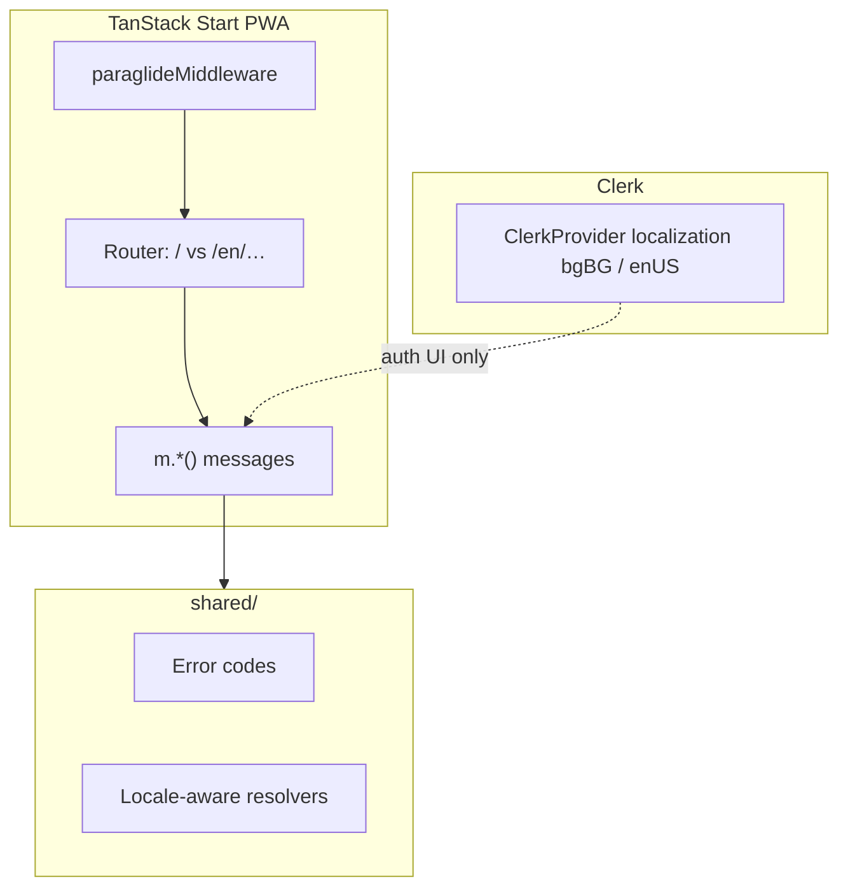

# i18n — implementation spec

Wayfinder map [#103](https://github.com/HayGrouve/onova-za-smetkata/issues/103). Resolves grilling [#110](https://github.com/HayGrouve/onova-za-smetkata/issues/110).

**Stack:** Paraglide JS (decided [#109](https://github.com/HayGrouve/onova-za-smetkata/issues/109)). Technical detail: `research/localization-approach.md`.

---

## Locked product decisions

| Decision         | Value                                                                                                                                |
| ---------------- | ------------------------------------------------------------------------------------------------------------------------------------ |
| **URL strategy** | Bulgarian default, **no prefix**; English **`/en/…` prefix**                                                                         |
| **Guest locale** | URL prefix → `Accept-Language` fallback → **manual picker on join** (cookie)                                                         |
| **Host locale**  | **Cookie only at v1** — no `users.preferredLocale`                                                                                   |
| **v1 languages** | **`bg` + `en` only**                                                                                                                 |
| **Legal pages**  | **Bulgarian only**; English UI shows notice that legal docs are BG-only                                                              |
| **Sequencing**   | **Parallel, Clerk leads** — Clerk auth/billing critical path; Paraglide infra alongside Clerk Phase 1; bulk string extraction trails |

---

## Architecture



**Locale detection order (guest join/claim):**

1. URL path prefix (`/en/…` → `en`, else `bg`)
2. Paraglide locale cookie (from prior picker visit)
3. `Accept-Language` header (first supported locale)
4. Default: `bg`

---

## Paraglide setup (Phase 1 — parallel with Clerk Phase 1)

1. Add `@inlang/paraglide-js` Vite plugin to `vite.config.ts`.
2. `project.inlang` — locales: `bg` (base), `en`.
3. `urlPatterns`: no prefix for `bg`; `/en/:path(.*)?` for `en`.
4. TanStack Start server entry wrapped in `paraglideMiddleware`.
5. Router: `deLocalizeUrl` / `localizeHref` for locale-agnostic internal links.
6. `<html lang={getLocale()}>` in root layout.
7. `formatEur` / `Intl.*` — pass active locale, not hardcoded `bg-BG`.

**Do not hand-edit** generated `src/paraglide/` (same rule as `convex/_generated`).

---

## Clerk integration

Clerk UI is localized separately via `@clerk/localizations`:

```tsx
import { bgBG, enUS } from '@clerk/localizations'

<ClerkProvider localization={locale === 'en' ? enUS : bgBG} …>
```

Sync `localization` prop with Paraglide `getLocale()`. App paywall/subscription copy uses Paraglide, not Clerk strings.

See also: `docs/specs/clerk-auth-billing-implementation.md` (quota error codes → Paraglide messages).

---

## Migration phases

| Phase                      | Work                                                                            | When                        |
| -------------------------- | ------------------------------------------------------------------------------- | --------------------------- |
| **1. Infrastructure**      | Vite plugin, middleware, `/en/` routing, `<html lang>`, locale-aware formatting | Parallel with Clerk Phase 1 |
| **2. Shared modules**      | Migrate `shared/*-messages.ts` to Paraglide catalog; Convex → error codes       | After infra                 |
| **3. New surfaces first**  | Clerk login, paywall modals, join page picker — build with `m.*()` from day one | With Clerk Phase 3          |
| **4. High-traffic routes** | Home, bill editor, join/claim                                                   | After Clerk cutover         |
| **5. Long tail**           | Remaining ~130 files inline strings                                             | Incremental                 |
| **6. Guidelines**          | Update `docs/agents/guidelines.md` — require Paraglide, not inline Cyrillic     | End                         |

---

## Guest join page

- Add compact **language picker** (BG / EN) on `/join` and `/en/join`.
- Persist choice in Paraglide locale cookie.
- Share links: hosts sharing `/en/join?t=…` deliver English; bare `/join?t=…` uses detection chain above.

---

## Convex errors

Pattern (from research):

```typescript
// Mutation
throw new ConvexError({ code: 'QUOTA_BILLS' })

// Client / shared resolver
resolveError(code, locale) // → Paraglide message
```

Migrate existing Bulgarian `ConvexError` strings to codes during phases 2–5.

---

## Legal pages

- `/terms`, `/privacy` — **Bulgarian content only** (unchanged jurisdiction).
- English routes (`/en/terms`): short Paraglide notice + link to Bulgarian canonical page.

---

## E2E (implementation default)

- Primary Playwright suite runs in **`bg`** (default URLs).
- Spot-check critical guest path in **`en`** (`/en/join`).
- Prefer **`data-testid`** over translated text selectors.

---

## Out of scope (v1)

- Host locale persisted on profile / Clerk metadata
- Legal page full English translation
- Locales beyond `bg` + `en`
- Translation CMS (Lokalise/Crowdin) — manual JSON in repo for v1

---

## References

- `research/localization-approach.md`
- [Paraglide TanStack Start](https://paraglidejs.com/tanstack-start)
- [Clerk localization](https://clerk.com/docs/guides/customizing-clerk/localization)
- `docs/specs/clerk-auth-billing-implementation.md`
