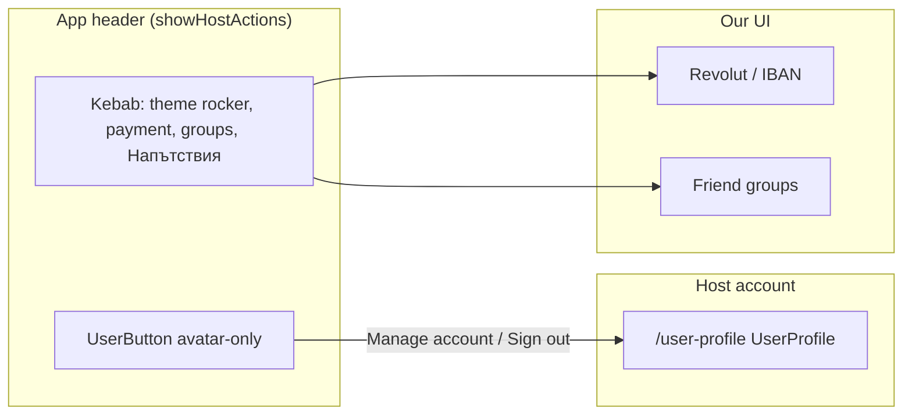

# Kebab chrome and Auth name — implementation spec

Wayfinder map [Host kebab chrome after Clerk](https://github.com/HayGrouve/onova-za-smetkata/issues/149). Resolves [Lock kebab chrome and Auth name spec](https://github.com/HayGrouve/onova-za-smetkata/issues/151). Theme look: [Compact three-mode theme control](https://github.com/HayGrouve/onova-za-smetkata/issues/150) (variant B on `prototype/theme-control`).

**Status:** Locked for implementation. This spec is the hand-off; it does not implement the UI.

**Scope:** After Clerk **Host account**, drop the in-app **Профил** surface and kebab **Изход**. Host participant name is **Auth name**, else **домакин**. Theme in the kebab is a compact three-stop rocker. Host Pro usage is not shown from this chrome.

Domain: [`CONTEXT.md`](../../CONTEXT.md). Supersedes kebab/profile/sign-out rows in [`app-header-menu.md`](./app-header-menu.md) and [`host-account-ui.md`](./host-account-ui.md). Auth: [ADR 0002](../adr/0002-clerk-auth-billing.md). Host Pro stays Stripe ([ADR 0003](../adr/0003-stripe-billing-beside-clerk.md)).

---

## Locked product decisions

| Decision                   | Value                                                                                                                                                      | Source                                                            |
| -------------------------- | ---------------------------------------------------------------------------------------------------------------------------------------------------------- | ----------------------------------------------------------------- |
| Host profile               | Retired. No in-app **Профил** sheet. No kebab **Профил**.                                                                                                  | charting                                                          |
| Username                   | Retired as a product field. Do not read or write `users.username` for the Host seat.                                                                       | charting                                                          |
| Auth name                  | Clerk Host account name (`identity.name` / keep `users.name` in sync). Editable in UserProfile.                                                            | charting                                                          |
| Host seat name             | At **bill create** only: Auth name, else **домакин**. Snapshot on the participant row. Later Clerk name changes do not rewrite existing bills.             | charting                                                          |
| Welcome                    | Keep intro stage. Drop the name stage (and copy that points at **Профил**). Intro primary creates the bill. Intro title/body/buttons stay as they are.     | charting                                                          |
| Sign-out                   | Clerk UserButton only. No kebab **Изход**, no kebab confirm.                                                                                               | charting                                                          |
| Viewer label               | Drop the kebab viewer-name line.                                                                                                                           | charting                                                          |
| Remaining kebab host items | **Настройки за плащане** → **Моите групи** → **Помощ и напътствия**. Same **Още настройки** nest on non-home as today.                                     | charting                                                          |
| Theme placement            | Stays in the kebab on every route the menu is visible, including guest join/claim (no UserButton there).                                                   | charting                                                          |
| Theme control              | Three-stop rocker: sun \| system \| moon, sliding thumb, `h-11`, kebab `w-52`. Selected icon on the thumb. Not three inverted cells, not an arrow stepper. | [#150](https://github.com/HayGrouve/onova-za-smetkata/issues/150) |
| Host Pro usage             | Not in the kebab or a profile sheet. Quota paywall elsewhere stays; Stripe portal is not this spec.                                                        | charting                                                          |

---

## Architecture

| Layer                          | Owns                                                                                                                 |
| ------------------------------ | -------------------------------------------------------------------------------------------------------------------- |
| Clerk UserButton / UserProfile | Host account including **Auth name**, emails, password/passkeys, MFA, Google, sessions, delete account, **Sign out** |
| Convex at bill create          | Host participant name = current Auth name, else **домакин**. Do not use `users.username`.                            |
| Kebab                          | Theme rocker + payment + groups + Напътствия. Not profile, not sign-out, not viewer label.                           |
| Stripe (not this spec)         | Host Pro checkout / Customer Portal                                                                                  |

Name resolution module: `shared/host-profile.ts` (`resolveHostParticipantName`, `planHostParticipantOnBillCreate`) — drop the Username branch. Welcome must not call `planUsernameOnWelcomeConfirm` or `users.saveUsername`.

If `users.name` can lag Clerk, patch it from `identity.name` on auth / bill create so **new** bills see the current Auth name.

---

## Kebab composition (supersedes `app-header-menu.md` chrome)

Bill-group matrix on editor / summary / host claim is unchanged. Only chrome around it changes.

| Section               | When shown            | Content                                                    |
| --------------------- | --------------------- | ---------------------------------------------------------- |
| Viewer label          | never                 | —                                                          |
| **Сметка** bill group | unchanged             | unchanged                                                  |
| Theme                 | always (menu visible) | three-stop rocker, not three radio rows                    |
| Global host items     | `showHostActions`     | payment → groups → Напътствия. No **Профил**, no **Изход** |

Guest join/claim: theme rocker only.

Changing theme must not close the menu (today’s radio items do). Icon-only stops still need accessible names: **Светла**, **Системна**, **Тъмна**. Keep `next-themes` light / dark / system.

Visual target (rewrite, do not promote prototype code): `prototype/theme-control` variant B — rounded-full track, sliding thumb, three Lucide stops (Sun, Monitor, Moon).

---

## Welcome

`WelcomeSheet` stages today: `intro` → `name`. After this spec: **intro only** (plus the existing-bills branch).

- Intro primary creates the first bill (today that happens after confirming a name).
- Do not persist a product name. Do not show `nameHelper` («Може да го промените по-късно от Профил»).
- Host seat on that bill uses Auth name, else **домакин** — same as `bills.create`.

---

## Implementers must not

- Revive an in-app **Профил** sheet or kebab **Профил**.
- Keep kebab **Изход** or a second confirm next to UserButton Sign out.
- Prefer `users.username` over Auth name, or save a welcome-typed name as Username.
- Live-update Host seat names on existing bills when Clerk name changes.
- Enable Clerk username as a sign-in identifier.
- Put payment, groups, theme, Напътствия, or Host Pro into UserProfile custom pages.
- Show Free/Pro usage in kebab chrome (Host Pro UI is a later effort).
- Title Clerk UserProfile **Профил**.
- Ship the prototype route as production.

---

## E2E and copy sweep

Reuse Clerk Testing Tokens (`e2e/helpers/host-auth.ts`). Update `e2e/host-account-route.spec.ts` and any kebab assertions:

1. Signed-in Host kebab: **no** **Профил**, **no** **Изход**, **no** viewer-name label. **Настройки за плащане** / **Моите групи** / **Помощ и напътствия** still present (nested under **Още настройки** off home).
2. UserButton still left of **Настройки**; Manage account still opens **Акаунт**.
3. Guest join/claim: still no UserButton; theme control still in the kebab.
4. Welcome: no name field; intro can still start a bill.

Grep after implementation: no product **Профил** sheet entry, no kebab `Изход`, no `openProfile` from the header menu. `getSignOutCopy` may remain unused until deleted.

---

## Follow-ups (not this spec)

- Whether to delete `users.username`, `users.saveUsername`, and `ProfileSheet` in the same PR or a cleanup PR. Product behavior: unused.
- Stripe Customer Portal / paywall CTA (ADR 0003).
- Rewriting welcome intro wording beyond dropping the name stage.
- Convex `users` row cleanup on Clerk `user.deleted`.

---

## Implementation sketch

1. `resolveHostParticipantName` / `planHostParticipantOnBillCreate`: Auth name else **домакин**.
2. `bills.create` and host-onboarding create: stop passing Username / confirmed welcome name as the seat override.
3. Welcome: drop name stage; intro creates the bill.
4. Remove ProfileSheet from kebab (and the sheet from product chrome).
5. Remove kebab **Изход** + viewer label.
6. Replace three theme radio rows with the rocker; keep system mode.
7. E2E + `pnpm run ci:preflight`; 390px pass of the open kebab on home and a guest join URL.
