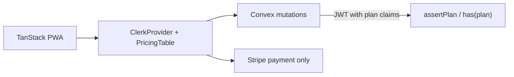
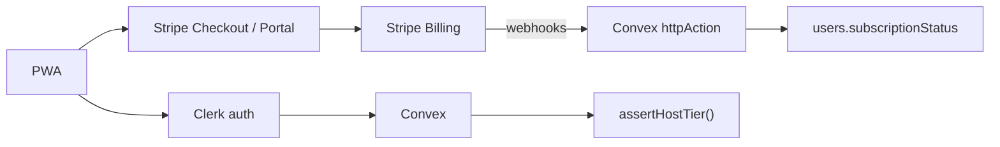
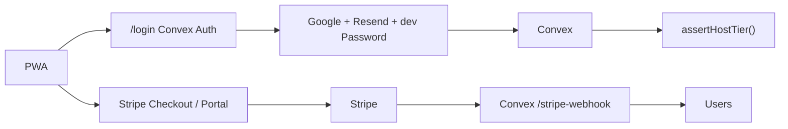

# Auth + billing alternatives

Research for [#103](https://github.com/HayGrouve/onova-za-smetkata/issues/103) (wayfinder map) — answers [#106](https://github.com/HayGrouve/onova-za-smetkata/issues/106).

**Question:** For free-tier bill/OCR limits and a paid unlock, compare three stacks: Clerk all-in, Clerk auth + Stripe Billing, and keep `@convex-dev/auth` + Stripe directly.

**Scope:** Host authentication and SaaS subscription only. Guest join/claim stays share-token + guest session (out of scope per #103).

---

## Current state (baseline)

| Area                   | Today                                                                                                                             |
| ---------------------- | --------------------------------------------------------------------------------------------------------------------------------- |
| **Auth**               | `@convex-dev/auth` in `convex/auth.ts` — Google OAuth, Resend magic link, dev-only Password (`DEV_MODE`)                          |
| **Users**              | `users` table: `name`, `image`, `email`, `username` — no billing fields (`convex/schema.ts`)                                      |
| **Identity in Convex** | `getAuthUserId()` → `Id<'users'>` via `convex/lib/auth.ts`; ~20 call sites (`requireAuth`, `useConvexAuth`, login route)          |
| **Quotas**             | Operational rate limits only (`rateLimitBuckets`, e.g. OCR 10/hour per bill in `convex/receiptScan.ts`) — no per-user tier yet    |
| **OAuth branding**     | ADR [0001](../docs/adr/0001-google-oauth-branding.md): GCP consent screen shows app name/logo; callback domain is `*.convex.site` |
| **HTTP**               | `convex/http.ts` routes Convex Auth only (`auth.addHttpRoutes`)                                                                   |
| **Frontend auth**      | Custom Bulgarian `/login` page; `useRequireHostAuth`; dev auto-sign-in via Password provider                                      |

Any paid-tier work adds **subscription fields + enforcement helpers** on top of this baseline, regardless of approach.

---

## Product requirements (from #103, not yet specified)

- Free tier: limits on bills/month and OCR scans
- Paid tier: higher or unlimited quotas
- Currency likely EUR; Bulgarian payment UX copy
- Lapsed subscription behavior TBD (read-only vs grace vs hard block)
- Existing hosts may need grandfathering

---

## Approach A — Clerk auth + Clerk Billing

Clerk handles sign-in UI, user records, checkout, plan management, and plan-aware authorization. Stripe is used **only for payment processing**; plans live in the Clerk Dashboard and do **not** sync to Stripe Billing products ([Clerk Billing overview](https://clerk.com/docs/guides/billing/overview)).

### Architecture sketch



- Frontend: `ClerkProvider` + `@tanstack/react-start`, `ConvexProviderWithClerk` ([Clerk ↔ Convex integration](https://clerk.com/docs/guides/development/integrations/databases/convex))
- Billing UI: `<PricingTable />`, `<SubscriptionDetailsButton />`, `clerk.billing.startCheckout({ planId, planPeriod })`
- Enforcement: `user.has({ plan: 'pro' })` from signed session JWT (`pla` claim); customize JWT template if needed ([plan checks](https://clerk.com/docs/reference/backend/types/auth-object))

### Pros (Bulgarian PWA)

| Benefit                | Detail                                                                                                                                                                 |
| ---------------------- | ---------------------------------------------------------------------------------------------------------------------------------------------------------------------- |
| **Unified stack**      | Auth + checkout + self-service subscription in one vendor; minimal billing UI to build                                                                                 |
| **OAuth branding**     | Clerk-hosted Google OAuth shows Clerk/app branding — likely **supersedes ADR 0001** `*.convex.site` callback concern                                                   |
| **Bulgarian UI**       | `bgBG` localization for Clerk components ([localization guide](https://clerk.com/docs/guides/customizing-clerk/localization)); product-specific tier copy still custom |
| **Convex integration** | Official `convex/react-clerk` pattern; use Convex `Authenticated`/`Unauthenticated`, not Clerk's, for sync                                                             |
| **Plan gating**        | Built-in `has({ plan })` / Features on JWT — fast path for mutation guards                                                                                             |

### Cons

| Risk                               | Detail                                                                                                                                                                                  |
| ---------------------------------- | --------------------------------------------------------------------------------------------------------------------------------------------------------------------------------------- |
| **Auth migration cost**            | **Highest.** Replace `@convex-dev/auth` across Convex + frontend; remap every `Id<'users'>` FK (`bills.ownerId`, `paymentSettings`, `friendGroups`, `hostOnboarding`, …)                |
| **Dev/E2E story**                  | Lose dev Password provider; need Clerk test users / `@clerk/testing` or fixture accounts                                                                                                |
| **Clerk Billing ≠ Stripe Billing** | Plans, invoices, and subscription objects in Clerk Dashboard only; Stripe dashboard sees payments, not plan catalog ([FAQ](https://clerk.com/docs/guides/billing/overview))             |
| **Fees**                           | 0.7% Clerk Billing volume + Stripe ~2.9% + €0.30 ([Clerk pricing](https://clerk.com/pricing)) — marketed as same all-in as Stripe Billing + processing, but you pay Clerk MRU tiers too |
| **Feature gaps**                   | Usage-based billing “coming soon”; seat-based plans target B2B orgs, not host-only B2C                                                                                                  |
| **Vendor lock-in**                 | **High** — auth users, session model, and billing plans all in Clerk; export/migration is non-trivial                                                                                   |
| **Magic link UX**                  | Custom Resend templates and Bulgarian login page replaced by Clerk flows (customizable but different)                                                                                   |

### Subscription enforcement in Convex

1. Configure Clerk “Plans for Users” (B2C) in Dashboard.
2. Add plan/feature claims to Clerk JWT template (`pla`, `fea`).
3. In mutations: read `ctx.auth.getUserIdentity()` claims **or** call Clerk backend `has({ plan })` from **httpAction** (avoid per-mutation Clerk API calls — latency + rate limits).
4. Prefer **mirroring tier into Convex** on webhook-like Clerk billing events if exposed, or periodic sync — Clerk Billing webhook story is thinner than Stripe's; verify event coverage before relying on JWT alone (JWT can lag cancel/downgrade until refresh).

### Migration cost: **Large (L)**

- New auth provider wiring (providers, hooks, login route, header sign-out)
- User ID mapping table: `legacyUserId → clerkUserId` or one-time migration script
- Re-test all host flows, onboarding, E2E
- New env secrets (`CLERK_*`) on Convex + Vercel
- Supersedes ADR 0001; new OAuth client or Clerk-managed Google app

---

## Approach B — Clerk auth only + Stripe Billing (separate)

Same auth migration as A, but subscriptions are modeled in **Stripe Billing** (Checkout, Customer Portal, webhooks). Clerk handles identity only.

### Architecture sketch



- Create/link `stripeCustomerId` on first checkout (store on `users` or Clerk `publicMetadata` — **enforce from Convex DB**, not client metadata)
- Checkout: Convex action creates Stripe Checkout Session (`mode: 'subscription'`) ([Stripe Checkout subscriptions](https://docs.stripe.com/payments/checkout/set-up-a-subscription))
- Portal: `stripe.billingPortal.sessions.create({ customer, return_url })` for manage/cancel
- Webhooks: `customer.subscription.created|updated|deleted` → update Convex ([Stripe provision access guide](https://docs.stripe.com/billing/subscriptions/build-subscriptions))

### Pros (Bulgarian PWA)

| Benefit                   | Detail                                                                                                                                                |
| ------------------------- | ----------------------------------------------------------------------------------------------------------------------------------------------------- |
| **Stripe Bulgaria / EUR** | Stripe Billing + Customer Portal available in BG; EUR pricing during euro transition ([Stripe BG Billing](https://stripe.com/en-bg/billing/features)) |
| **Portable billing**      | Standard Stripe objects — analytics, tax tools, future Paddle/etc. migration path for **billing only**                                                |
| **No Clerk Billing fee**  | Avoid 0.7% Clerk Billing surcharge (Stripe processing fees only)                                                                                      |
| **Full Billing features** | Subscription schedules, proration, invoices, dunning — mature vs Clerk Billing                                                                        |
| **OAuth branding**        | Same Clerk auth benefits as A                                                                                                                         |

### Cons

| Risk                        | Detail                                                                                                                                 |
| --------------------------- | -------------------------------------------------------------------------------------------------------------------------------------- |
| **Auth migration cost**     | Same **Large** cost as A — Clerk still replaces `@convex-dev/auth`                                                                     |
| **More custom code than A** | Build upgrade UI, checkout redirect, portal entry, webhook idempotency, tier sync                                                      |
| **Split brain**             | Clerk `userId` + Stripe `customerId` + Convex `users` row — must keep mapping consistent                                               |
| **Enforcement**             | Plan **not** in Clerk JWT unless you mirror Stripe status to Clerk metadata; **authoritative tier in Convex** updated by webhooks      |
| **Webhook ops**             | Signature verification, retries, dead-letter handling — pattern exists (`httpAction` + `"use node"` + `constructEvent`) but you own it |
| **Vendor lock-in**          | **Medium** — Clerk for auth; billing data portable via Stripe                                                                          |

### Subscription enforcement in Convex

Recommended pattern (same for B and C):

```typescript
// convex/schema.ts — extend users
stripeCustomerId: v.optional(v.string()),
subscriptionTier: v.union(v.literal('free'), v.literal('pro')),
subscriptionStatus: v.optional(v.string()), // active, past_due, canceled, …
subscriptionPeriodEnd: v.optional(v.number()),

// convex/lib/hostTier.ts
export async function assertCanCreateBill(ctx, userId) {
  const tier = await getEffectiveTier(ctx, userId)
  const count = await countBillsThisMonth(ctx, userId)
  if (tier === 'free' && count >= FREE_BILL_LIMIT) {
    throw new ConvexError('…') // Bulgarian copy
  }
}
```

- Webhook handler in `convex/http.ts` (alongside or replacing auth routes)
- `internal.stripe.handleWebhook` action verifies signature, calls `internal.subscriptions.applyEvent` mutation
- Mutations call `assertCanCreateBill` / `assertCanScanReceipt` — **never** trust client or Stripe alone without webhook-synced DB

### Migration cost: **Large (L)** for auth + **Medium (M)** for billing

Auth migration dominates. Billing adds ~1–2 weeks: schema, webhook pipeline, checkout/portal actions, upgrade UX, tests.

---

## Approach C — Keep Convex Auth + Stripe Billing / Checkout

No auth provider change. Add Stripe as the billing vendor and extend the existing `users` table and Convex HTTP router.

### Architecture sketch



- **Unchanged:** `convex/auth.ts`, `getAuthUserId`, `users._id` FK graph, dev Password E2E, custom Bulgarian login page
- **Add:** Stripe customer on first upgrade, Checkout Session action, Portal session action, webhook route in `convex/http.ts`
- **Enforcement:** Same `assertHostTier` helpers as B, keyed by existing `Id<'users'>`

### Pros (Bulgarian PWA)

| Benefit                       | Detail                                                                                        |
| ----------------------------- | --------------------------------------------------------------------------------------------- |
| **Lowest migration cost**     | **Small (S)** — no user ID remap, no auth rewrite                                             |
| **Keep ADR 0001**             | Google OAuth branding strategy unchanged; optional later `CUSTOM_AUTH_SITE_URL` on Convex Pro |
| **Keep magic link**           | Resend + custom Bulgarian copy on `/login`                                                    |
| **Keep dev/E2E**              | `DEV_MODE` Password provider and `DevAutoSignIn` continue to work                             |
| **Stripe BG / EUR**           | Same as B — Checkout, subscriptions, Customer Portal                                          |
| **Convex-native enforcement** | Tier lives next to bills/OCR logic; `ownerId` stays stable                                    |
| **Vendor lock-in**            | **Lowest** — auth stays open (@auth/core providers); billing is standard Stripe               |

### Cons

| Risk                         | Detail                                                                                                       |
| ---------------------------- | ------------------------------------------------------------------------------------------------------------ |
| **OAuth domain line**        | Users still see `<deployment>.convex.site` on Google consent (ADR 0001 accepted tradeoff)                    |
| **Build all billing UX**     | Same custom work as B (checkout, portal, paywall modals, Bulgarian strings) — **no** Clerk PricingTable      |
| **Webhook + sync ownership** | Full responsibility for idempotency, race conditions (checkout complete vs subscription updated)             |
| **No JWT plan claims**       | Tier check = DB read in each guarded mutation (cheap with indexed `users` row) or cached denormalized fields |
| **Two vendors**              | Convex Auth + Stripe — but no third identity vendor                                                          |

### Subscription enforcement in Convex

Identical webhook + `assertHostTier` pattern as Approach B. Existing `assertRateLimit` in `convex/lib/rateLimit.ts` becomes a **secondary** guard; tier limits replace or wrap hardcoded caps (e.g. OCR 10/hour per bill → tier-based monthly OCR budget per user).

Example webhook wiring ([Convex HTTP actions pattern](https://docs.convex.dev/functions/http-actions)):

```typescript
// convex/http.ts
http.route({
  path: '/stripe-webhook',
  method: 'POST',
  handler: httpAction(async (ctx, request) => {
    const signature = request.headers.get('stripe-signature')
    if (!signature) return new Response('Missing signature', { status: 400 })
    const body = await request.text()
    await ctx.runAction(internal.stripe.handleWebhook, { body, signature })
    return new Response(null, { status: 200 })
  }),
})
```

Guard points (initial):

| Mutation / area           | Guard                                                                        |
| ------------------------- | ---------------------------------------------------------------------------- |
| `bills.create`            | Monthly bill count vs tier                                                   |
| `receiptScan.startScan`   | Monthly OCR count vs tier (may keep per-bill rate limit as abuse protection) |
| `files.generateUploadUrl` | Optional upload quota                                                        |

### Migration cost: **Small (S)** — billing only

- Schema extension on `users` (+ optional `subscriptionEvents` audit table)
- New Convex modules: `convex/stripe.ts`, `convex/subscriptions.ts`, `convex/lib/hostTier.ts`
- Frontend: upgrade CTA, Stripe redirect handling, subscription status in profile sheet
- Stripe Dashboard: products/prices in EUR, Customer Portal config, webhook endpoint
- **No** auth migration, **no** FK rewrite

---

## Side-by-side comparison

| Dimension                    | A: Clerk + Clerk Billing                        | B: Clerk + Stripe Billing               | C: Convex Auth + Stripe              |
| ---------------------------- | ----------------------------------------------- | --------------------------------------- | ------------------------------------ |
| **Auth migration**           | Large                                           | Large                                   | None                                 |
| **Billing implementation**   | Small (prebuilt UI)                             | Medium (Checkout + webhooks)            | Medium (same as B)                   |
| **Total migration cost**     | **L**                                           | **L + M**                               | **S + M**                            |
| **Bulgarian login UX**       | Clerk components (`bgBG`, community-maintained) | Same                                    | Keep custom `/login` + Resend        |
| **Google OAuth branding**    | Clerk UI (ADR 0001 superseded)                  | Same                                    | ADR 0001 unchanged (`*.convex.site`) |
| **EUR / BG payments**        | Via Stripe processing                           | Full Stripe Billing BG                  | Full Stripe Billing BG               |
| **Subscription enforcement** | JWT `has({ plan })` + optional Convex mirror    | Convex DB via Stripe webhooks           | Convex DB via Stripe webhooks        |
| **Dev / E2E auth**           | Clerk test mode (rewrite)                       | Same                                    | Keep Password dev provider           |
| **User ID stability**        | Breaks (`Id<'users'>` remap)                    | Breaks                                  | **Preserved**                        |
| **Vendor lock-in**           | **High** (auth + billing)                       | **Medium** (auth Clerk, billing Stripe) | **Low** (billing Stripe only)        |
| **Ongoing fees**             | Clerk MRU + 0.7% billing + Stripe               | Clerk MRU + Stripe                      | Stripe only                          |
| **Operational complexity**   | Lowest at runtime                               | Medium                                  | Medium                               |

---

## Subscription enforcement — recommended pattern (all approaches)

Regardless of vendor, **Convex mutations should be the enforcement gate** for bill/OCR quotas:

1. **Source of truth:** Convex `users` (or dedicated `subscriptions` table) updated by trusted backend events — not client flags.
2. **Webhooks (B, C):** Handle `checkout.session.completed`, `customer.subscription.updated`, `customer.subscription.deleted`, `invoice.payment_failed`; verify signatures with raw body ([Stripe webhook docs](https://docs.stripe.com/webhooks/signature)).
3. **Idempotency:** Store processed Stripe event IDs; webhooks can retry.
4. **Grace period:** Product decision — e.g. `past_due` allows read-only for 7 days, then downgrade to free limits.
5. **Queries:** Expose `viewer.subscription` for UI paywalls; mutations enforce hard limits.
6. **Abuse:** Keep existing `assertRateLimit` for per-bill OCR and guest flows.

For **A only:** supplement JWT plan checks with Convex mirror if JWT refresh lag on cancel is unacceptable.

---

## Migration notes (existing hosts)

Applies to **A and B** (auth provider change):

| Data                | Risk                                           |
| ------------------- | ---------------------------------------------- |
| `bills.ownerId`     | Must preserve or remap to new user IDs         |
| `users.email`       | Match key for migration (`email` index exists) |
| `users.username`    | Copy to new profile                            |
| Active sessions     | All hosts re-login once                        |
| Google / magic link | Same email → same person, new auth subject     |

**C:** Existing `users` rows gain optional `stripeCustomerId` on first checkout — no ID change.

**Grandfathering:** Implement via `subscriptionTier: 'legacy'` or one-time `freeBillBonus` field set during migration script — independent of auth choice.

---

## Vendor lock-in summary

| Approach | Auth exit path                                      | Billing exit path                                                    |
| -------- | --------------------------------------------------- | -------------------------------------------------------------------- |
| **A**    | Export Clerk users → re-provision auth; rewrite app | Re-create plans in Stripe; no automatic export from Clerk Billing    |
| **B**    | Same auth exit as A                                 | Standard Stripe migration (subscriptions API, customer IDs portable) |
| **C**    | Already on portable OAuth providers (@auth/core)    | Standard Stripe migration                                            |

---

## Recommendation (research-only, not a go/no-go)

For **Онова за сметката** today:

1. **If minimizing migration risk and preserving `ownerId` graph matters** → **C** is the clear default. Billing work (B vs C) is nearly identical; C avoids a high-risk auth rewrite for a host-only B2C PWA that already has working Google + magic link + dev auth.

2. **If OAuth consent-screen distrust becomes a support issue** → **B** (or A) improves branding, but costs a full auth migration. Consider first whether ADR 0001 + in-app branded `/login` is sufficient.

3. **If speed-to-market on billing UI matters more than migration cost** → **A** reduces frontend billing work, but locks plans into Clerk Billing and couples auth migration to monetization launch.

**Pragmatic split:** **C for billing + enforcement now**; revisit Clerk auth only if user research validates the `*.convex.site` OAuth domain as a conversion blocker (#101).

---

## Open questions (for #103 grilling / domain modeling)

- Exact free-tier numbers (bills/month, OCR/month) and paid price in EUR
- Lapsed subscription UX (Bulgarian copy for paywall vs read-only)
- Grandfathering existing hosts
- Whether Clerk Billing usage-based pricing (when GA) changes the A vs B economics
- Invoice / receipt requirements for Bulgarian B2C SaaS (Stripe Tax vs manual)

---

## References

- Repo: `convex/auth.ts`, `convex/schema.ts` (`users`), `convex/lib/auth.ts`, `docs/adr/0001-google-oauth-branding.md`
- [Clerk Billing overview](https://clerk.com/docs/guides/billing/overview)
- [Clerk ↔ Convex integration](https://clerk.com/docs/guides/development/integrations/databases/convex)
- [Clerk plan checks (`has`)](https://clerk.com/docs/reference/backend/types/auth-object)
- [Stripe subscriptions + webhooks](https://docs.stripe.com/billing/subscriptions/build-subscriptions)
- [Convex HTTP actions](https://docs.convex.dev/functions/http-actions)
- [Convex Auth docs](https://labs.convex.dev/auth)
- Example: [get-convex/convex-saas](https://github.com/get-convex/convex-saas) Stripe webhook in `convex/http.ts`
