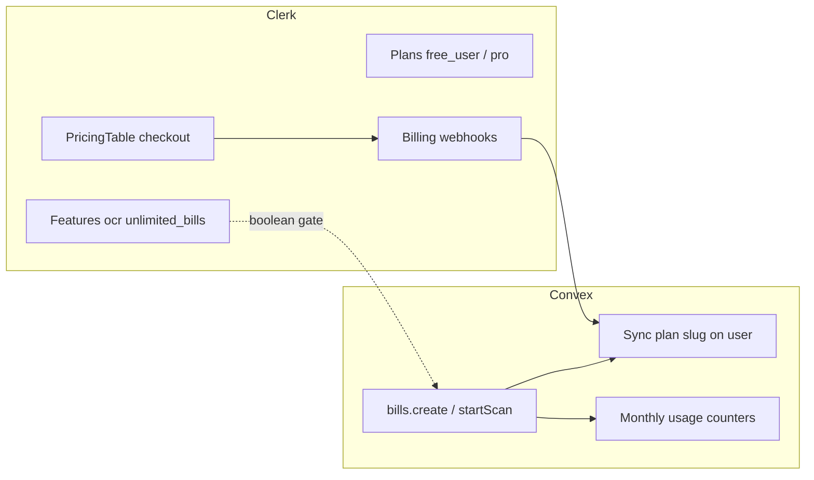

# Research: Clerk Billing (B2C) — tier gates vs metered quotas

Part of wayfinder map [#103](https://github.com/HayGrouve/onova-za-smetkata/issues/103). Resolves research ticket [#104](https://github.com/HayGrouve/onova-za-smetkata/issues/104).

## Question

For a B2C free vs paid tier model, what does **Clerk Billing** provide out of the box — binary plan/feature gates, or metered usage limits like “5 bills per month” and “N OCR scans per month”? What must be enforced in **Convex**?

## Executive summary

| Concern                                        | Clerk Billing                                                 | Convex (this app)                                       |
| ---------------------------------------------- | ------------------------------------------------------------- | ------------------------------------------------------- |
| “Paid users can use OCR at all”                | ✅ Feature/plan gate via `has({ feature })` / `has({ plan })` | Optional mirror for UX; not sufficient alone            |
| “Free users get 5 bills/month, paid unlimited” | ❌ No quota engine                                            | ✅ Count bills per user per calendar month in mutations |
| “Free users get N OCR scans/month”             | ❌ No quota engine                                            | ✅ Count scans per user per month in `startScan`        |
| Abuse / burst protection (any tier)            | ❌ Not Clerk’s job                                            | ✅ Keep existing sliding-window `assertRateLimit`       |

**Clerk Billing is an entitlement layer (plans + boolean features + checkout), not a usage-metering product.** Metered / usage-based billing for your own product metrics is listed as roadmap (“coming soon”) and is not available for enforcing per-user quotas like bills or OCR scans. Convex must own quota counting and enforcement; Clerk owns subscription state, checkout UI, and boolean gates.

---

## What Clerk Billing provides (B2C)

### Plans and features

- **Plans** — recurring subscription tiers configured in Dashboard → Billing → **Plans for Users** (B2C). Unlimited plan count; slugs are case-sensitive (e.g. `free_user`, `pro`).
- **Features** — boolean entitlements attached **per plan** in the plan’s Features section (not a global catalog). Same feature slug can appear on multiple plans. Example: `ocr`, `unlimited_bills`.
- **Default free plan** — enabling Billing auto-creates `free_user` / `free_org` and assigns every new user an active subscription on the free plan ([Default plans](https://clerk.com/docs/guides/billing/default-plans)).

Plans and pricing live entirely in Clerk; they are **not** synced to Stripe Products/Prices.

### Access control: `has()` and `checkAuthorization()`

Recommended gating APIs:

| API                                                     | Where                                                                  | Use for                                     |
| ------------------------------------------------------- | ---------------------------------------------------------------------- | ------------------------------------------- |
| `has({ plan: 'pro' })`                                  | Server (`auth()` from `@clerk/nextjs/server`) and client (`useAuth()`) | Tier-level gates (“Pro dashboard”)          |
| `has({ feature: 'ocr' })`                               | Same                                                                   | Capability gates (“Export CSV”, “OCR scan”) |
| `clerk.session.checkAuthorization({ plan \| feature })` | Clerk.js frontend                                                      | Same checks without framework `auth()`      |
| `<Show when={{ feature: '…' }}>`                        | React                                                                  | Declarative UI gates                        |

Session JWT carries billing claims used by `has()`:

- `pla` — active plan slug (org plans prefixed `o:` when an org is active)
- `fea` — entitled features

After checkout, the session must refresh (`clerk.session.reload()` or navigation) before `has()` reflects the new plan.

Generic backend (including a TanStack/Convex HTTP webhook route) can use `@clerk/backend`:

```typescript
import { createClerkClient } from '@clerk/backend'

const clerkClient = createClerkClient({ publishableKey, secretKey })

const reqState = await clerkClient.authenticateRequest(request, {
  authorizedParties: [domain],
})
const auth = reqState.toAuth()
if (!auth?.userId) return new Response('Unauthorized', { status: 401 })

const canOcr = auth.has({ feature: 'ocr' })
if (!canOcr) return new Response('Upgrade required', { status: 403 })
```

**Important:** Client-side and route-level `has()` checks are UX / early rejection only. Convex mutations that spend money (Gemini OCR) or create bill records must re-check entitlements and quotas server-side.

### B2C checkout UI

- `<PricingTable />` — renders user plans; selecting a plan opens Clerk’s in-app checkout drawer ([B2C billing guide](https://clerk.com/docs/guides/billing/for-b2c)).
- `clerk.billing.startCheckout({ planId, planPeriod })` — programmatic checkout entry.
- Profile/billing components let users manage subscriptions without custom Stripe UI.

Dev instances can use Clerk’s shared development payment gateway (no Stripe account). Production requires connecting a Stripe account for **payment processing only**.

### Billing webhooks

Clerk emits **Clerk-named** events (not Stripe event names). Key lifecycle events ([Billing webhooks](https://clerk.com/docs/guides/billing/billing-webhooks)):

| Event                                                                   | When                                                     |
| ----------------------------------------------------------------------- | -------------------------------------------------------- |
| `subscription.created`                                                  | Subscription initialized                                 |
| `subscription.updated` / `subscription.active` / `subscription.pastDue` | Container-level status changes                           |
| `subscriptionItem.active`                                               | Paid plan active after successful payment                |
| `subscriptionItem.canceled`                                             | Cancel at period end (features remain until period ends) |
| `subscriptionItem.pastDue`                                              | Recurring charge failed                                  |
| `subscriptionItem.freeTrialEnding`                                      | ~3 days before trial ends                                |
| `paymentAttempt.created` / `updated`                                    | Payment attempts                                         |

Payload shape: payer at `evt.data.payer.user_id` (B2C), plan slug on `evt.data.items[i].plan.slug`. Use these to **sync plan slug + status into Convex** (`users` table or a `subscriptions` shadow table).

There is **no** `subscription.canceled` — cancellation is `subscriptionItem.canceled` at the item level.

### What Clerk enforces natively (not app quotas)

- **Per-seat limits (B2B org plans)** — membership cap enforced at org invite time; per-seat pricing with included seats and proration ([Seat-based plans](https://clerk.com/docs/guides/billing/seat-based-plans)). This meters **org members**, not arbitrary app actions.
- **Billing-gated permissions** — with Orgs + Billing, `has({ permission: 'org:feature:action' })` returns false if the org’s active plan lacks that feature.

---

## What Clerk Billing does **not** provide

### Metered / usage-based product quotas

- **No** built-in “5 bills per month” or “N OCR scans per month” counters.
- **No** API to increment/report arbitrary usage events to Clerk for enforcement.
- Official positioning: Clerk Billing ≠ Stripe Billing; Stripe is used for payment rails only ([Billing overview FAQ](https://clerk.com/docs/guides/billing/overview)).
- [clerk.com/billing](https://clerk.com/billing) lists usage-based/metered billing under **Coming soon**; Stripe Sessions 2025 launch talk likewise described metered billing as upcoming, not shipped at launch.
- Reference types like `BillingPerUnitTotal` / `BillingPerUnitTotalTier` relate to **invoice/seat pricing display**, not app-side feature metering you can gate on from Convex.

### Other gaps relevant to this app

| Gap                                               | Implication                                                                             |
| ------------------------------------------------- | --------------------------------------------------------------------------------------- |
| Plans/subscriptions not visible in Stripe Billing | Do not expect Stripe Dashboard to show Clerk plan catalog or enforce Clerk entitlements |
| No tax/VAT (planned)                              | Handle separately if needed                                                             |
| Features are boolean                              | Cannot encode “50 scans/month” as a Clerk feature value                                 |

---

## Current OCR / rate limiting in this repo

Today’s limits are **abuse protection**, not subscription tiers.

### `convex/lib/rateLimit.ts`

Sliding-window counter in `rateLimitBuckets` keyed by arbitrary string:

```typescript
export async function assertRateLimit(
  ctx: MutationCtx,
  key: string,
  max: number,
  windowMs: number,
  message = 'Твърде много заявки. Опитайте отново след малко.',
): Promise<void>
```

### Call sites

| Location                                | Key                              | Limit  | Window | Purpose               |
| --------------------------------------- | -------------------------------- | ------ | ------ | --------------------- |
| `convex/receiptScan.ts` → `startScan`   | `ocr:${billId}`                  | 10     | 1 hour | Burst OCR per bill    |
| `convex/files.ts` → `generateUploadUrl` | `upload:${ownerId}`              | 30     | 1 hour | Upload burst per host |
| `convex/guestSessions.ts`               | various `claim:*`, `heartbeat:*` | varies | 1 min  | Guest session abuse   |
| `convex/assignments.ts`                 | `assign:joinUnit:*` etc.         | 60     | 1 min  | Assignment spam       |

`bills.create` (`convex/bills.ts`) has **no** monthly bill quota — only `requireAuth`.

These patterns should **remain** alongside subscription quotas (defense in depth).

---

## Recommended enforcement pattern for Онова за сметката

### Split responsibilities



1. **Clerk** — subscription lifecycle, checkout, boolean entitlements (`ocr`, `priority_support`, etc.).
2. **Convex webhook handler** (HTTP action) — on `subscriptionItem.active` / `canceled` / `updated`, upsert `users.clerkPlanSlug` (+ optional `subscriptionStatus`, `periodEnd`).
3. **Convex quota module** — new helper (or extend `rateLimit.ts`) for **calendar-month** counters, e.g.:
   - `usage:${userId}:bills:${yyyy-mm}` — increment in `bills.create`
   - `usage:${userId}:ocr:${yyyy-mm}` — increment in `receiptScan.startScan`
4. **Convex mutations (authoritative)** — order of checks:
   1. Authenticate host (`requireAuth` / future Clerk-verified identity).
   2. Read synced plan (or verify Clerk JWT `pla` / call Clerk Backend API on cache miss).
   3. If action requires a paid **feature**, check plan/feature mapping table in Convex (mirrors Clerk Dashboard slugs).
   4. If within tier, enforce **monthly quota** from Convex counters.
   5. Always run **burst** `assertRateLimit` last.

Example tier config (Convex constants or config table):

| Plan        | Bills / month | OCR scans / month | Notes                                |
| ----------- | ------------- | ----------------- | ------------------------------------ |
| `free_user` | 5             | 10                | Gate OCR feature optional            |
| `pro`       | unlimited     | unlimited         | Or high soft caps + rate limits only |

### UI layer

- Use `<Show when={{ feature: 'ocr' }}>` / `has({ feature: 'ocr' })` to hide OCR button and show upgrade CTA.
- Show remaining quota from a Convex query (`getMyUsage`) so copy is accurate — Clerk cannot supply this number.

### Plan sync vs live JWT check

| Approach                                                   | Pros                                                    | Cons                                                                  |
| ---------------------------------------------------------- | ------------------------------------------------------- | --------------------------------------------------------------------- |
| **Webhook → Convex user row** (recommended)                | Fast mutations; works offline from Clerk API; auditable | Must handle webhook delays; need reconciliation job                   |
| **Verify Clerk session JWT in Convex**                     | Always fresh                                            | Requires Clerk JWT integration with Convex auth; heavier per mutation |
| **Clerk Backend `getUserBillingSubscription` on each OCR** | Authoritative                                           | Latency + rate limits; overkill for every bill create                 |

**Recommendation:** webhook sync as source of truth for plan slug; optional periodic reconciliation via Clerk Backend API. Never rely on client `has()` alone before calling `startScan`.

### Binary vs metered for this product

| Product rule                                  | Clerk                                      | Convex                                   |
| --------------------------------------------- | ------------------------------------------ | ---------------------------------------- |
| Free users cannot OCR at all                  | `has({ feature: 'ocr' })` on Pro plan only | Deny `startScan` if plan lacks `ocr`     |
| Free users get 10 OCR/month but Pro unlimited | Optional feature flag for UX               | Count scans; cap free tier               |
| Free users get 5 bills/month                  | —                                          | Count `bills.create` per owner per month |
| 10 OCR/hour per bill (abuse)                  | —                                          | Keep existing `assertRateLimit`          |

---

## Key FAQ facts (Clerk Billing)

| Topic                      | Fact                                                                                                                                                                                           | Source                                                                     |
| -------------------------- | ---------------------------------------------------------------------------------------------------------------------------------------------------------------------------------------------- | -------------------------------------------------------------------------- |
| **Stripe sync**            | Clerk Billing is separate from Stripe Billing. Plans/subscriptions created in Clerk **are not synced** to your Stripe account. Payment/customer data appears in Stripe; plan catalog does not. | [Billing overview FAQ](https://clerk.com/docs/guides/billing/overview)     |
| **Fees**                   | **0.7% per transaction** via Clerk Billing, **plus Stripe processing fees** paid directly to Stripe. Described as comparable to using Stripe Billing directly for processing overhead.         | [Enable Billing partial](https://clerk.com/docs/guides/billing/overview)   |
| **Stripe setup**           | Stripe account needed in production for payment processing only — not Stripe Billing product setup.                                                                                            | Clerk Billing skill / enable-billing docs                                  |
| **Default plan**           | Every user gets an active subscription on `free_user` when Billing is enabled.                                                                                                                 | [Default plans](https://clerk.com/docs/guides/billing/default-plans)       |
| **Metered billing**        | Not available for app-defined usage quotas today; roadmap / “coming soon”.                                                                                                                     | [clerk.com/billing](https://clerk.com/billing), Stripe Sessions 2025       |
| **Tax/VAT**                | Not supported yet (planned).                                                                                                                                                                   | Billing overview FAQ                                                       |
| **Custom pricing**         | Supported for individual customers.                                                                                                                                                            | Billing overview FAQ                                                       |
| **Trials**                 | Live — `subscriptionItem.freeTrialEnding` webhook.                                                                                                                                             | clerk.com/billing, billing webhooks                                        |
| **Per-seat (B2B)**         | Live for org plans — not a substitute for bill/OCR metering in B2C.                                                                                                                            | [Seat-based plans](https://clerk.com/docs/guides/billing/seat-based-plans) |
| **Session after upgrade**  | `has()` may stay false until session reload.                                                                                                                                                   | Clerk billing skill error table                                            |
| **Clerk platform pricing** | Clerk’s own SaaS pricing uses MRUs (Monthly Retained Users) — unrelated to your app’s bill/OCR quotas.                                                                                         | [Clerk pricing / MRU](https://clerk.com/pricing)                           |

---

## Implications for wayfinder #103

When replacing `@convex-dev/auth` with Clerk:

1. Configure B2C plans (`free_user`, paid tier) and features in Clerk Dashboard.
2. Add billing webhook route → Convex HTTP action to sync plan state.
3. Implement Convex monthly quota counters for bills and OCR; keep burst rate limits.
4. Use Clerk `has({ feature })` for UI and route-level gates only.
5. Do **not** plan on Clerk to enforce “N per month” — that remains Convex logic tied to synced plan slug.

---

## Sources

- [Clerk Billing overview](https://clerk.com/docs/guides/billing/overview)
- [Clerk Billing for B2C SaaS](https://clerk.com/docs/guides/billing/for-b2c)
- [Default plans](https://clerk.com/docs/guides/billing/default-plans)
- [Billing webhooks](https://clerk.com/docs/guides/development/webhooks/billing)
- [Seat-based plans (B2B)](https://clerk.com/docs/guides/billing/seat-based-plans)
- [Auth object / `has()`](https://clerk.com/docs/reference/backend/types/auth-object)
- [Session token claims (`pla`, `fea`)](https://clerk.com/docs/guides/sessions/session-tokens)
- [Clerk Billing product page](https://clerk.com/billing)
- [Stripe Sessions 2025 — Clerk Billing launch (metered billing listed as coming soon)](https://stripe.com/sessions/2025/instant-zero-integration-saas-billing-with-clerk-stripe)
- Repo: `convex/receiptScan.ts`, `convex/lib/rateLimit.ts`, `convex/bills.ts`, `convex/files.ts`
