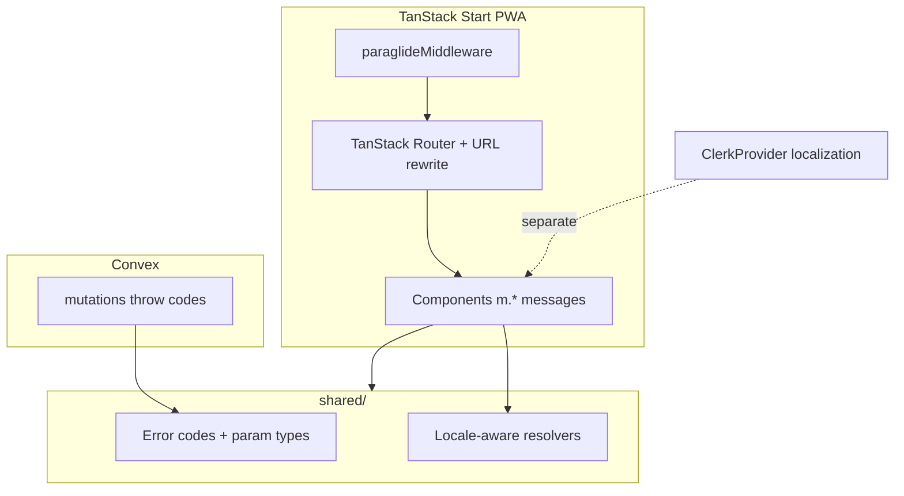

# Research: multi-language localization approach

Part of wayfinder map [#103](https://github.com/HayGrouve/onova-za-smetkata/issues/103). Resolves research ticket [#109](https://github.com/HayGrouve/onova-za-smetkata/issues/109).

## Question

What is the best approach to add **multi-language support** to Онова за сметката (TanStack Start PWA + Convex)? Today user-facing copy is hardcoded Bulgarian with no i18n framework.

## Executive summary

| Layer                                  | Recommendation                                                                                                            |
| -------------------------------------- | ------------------------------------------------------------------------------------------------------------------------- |
| **App UI (React + TanStack Start)**    | **Paraglide JS** — official TanStack Start adapter, compile-time messages, tree-shakable bundles, built-in locale routing |
| **Shared + Convex error strings**      | Locale-aware message functions from the same Paraglide catalog (or keyed dictionaries in `shared/` during migration)      |
| **Clerk auth/billing UI** (if adopted) | Separate concern: `@clerk/localizations` (`bgBG`, `enUS`, …) on `ClerkProvider` — does not translate app copy             |
| **Formatting**                         | Replace hardcoded `bg-BG` in `formatEur` with locale from active i18n runtime                                             |

**Do not adopt react-i18next for a greenfield TanStack Start setup** unless the team already standardizes on it — heavier runtime, manual routing glue, and lazy namespace loading add complexity a mobile PWA does not need when Paraglide compiles messages at build time.

**Lingui** is a solid second choice if the team prefers JSX `<Trans>` macros and ICU MessageFormat in source over Paraglide’s message modules — but TanStack Start routing integration is DIY ([TanStack Router i18n guide](https://tanstack.com/router/latest/docs/guide/internationalization-i18n) lists Paraglide as the documented integration).

---

## Current state in this repo

| Area                    | Today                                                                                                                                                                                                       |
| ----------------------- | ----------------------------------------------------------------------------------------------------------------------------------------------------------------------------------------------------------- |
| **Guideline**           | `docs/agents/guidelines.md`: “Bulgarian only — no i18n framework”                                                                                                                                           |
| **Centralized modules** | `shared/guest-flow-messages.ts`, `shared/combined-payment-messages.ts`, `shared/host-onboarding-messages.ts`, `src/lib/destructive-action-copy.ts` — plain `as const` objects, already imported from Convex |
| **Spread strings**      | ~130+ TS/TSX files with inline Cyrillic copy (routes, components, validation, Convex `ConvexError` messages)                                                                                                |
| **Locale formatting**   | `Intl.NumberFormat('bg-BG', …)` hardcoded in `src/lib/format-currency.ts`; `og:locale` = `bg_BG` in `src/lib/site-meta.ts`                                                                                  |
| **Guest flows**         | No auth; share links (`?t=…`) — locale must be detectable without a Host profile                                                                                                                            |
| **Dependencies**        | No i18n packages in `package.json`                                                                                                                                                                          |

Existing **shared message modules** are the right seam for cross-layer strings (client + Convex). Any i18n approach should extend this pattern, not replace it with client-only JSON.

---

## Requirements implied by the product

1. **Mobile PWA** — bundle size matters; prefer compile-time extraction over shipping all locales in one JSON blob.
2. **TanStack Start SSR** — locale must be resolved on the server for first paint (`<html lang>`, meta tags) without hydration mismatch.
3. **Guest + Host routes** — Guests join via deep links; locale cannot depend on Host auth or stored profile alone.
4. **Convex mutations** — Server throws user-visible errors (`ConvexError` with Bulgarian strings today). Need a strategy that works without React context.
5. **Bulgarian remains default** — Product origin and primary market; English (or others) are additive.
6. **Clerk (optional)** — If map #103 chooses Clerk, auth/checkout components get `@clerk/localizations`; app strings remain a separate catalog ([Clerk localization docs](https://clerk.com/docs/guides/customizing-clerk/localization)).

---

## Options compared

### A — Paraglide JS (recommended)

[Paraglide for TanStack Start](https://paraglidejs.com/tanstack-start) · [TanStack Router i18n guide](https://tanstack.com/router/latest/docs/guide/internationalization-i18n)

**How it works:** `@inlang/paraglide-js` Vite plugin compiles messages from `messages/*.json` (or inlang project) into tree-shakable functions under `src/paraglide/`. Locale detection uses configurable **strategies**: URL prefix, cookie, `Accept-Language`, base locale fallback.

**TanStack Start integration:**

- Add `paraglideVitePlugin` to `vite.config.ts` with `urlPatterns` (e.g. `/en/:path` prefix for English, no prefix for Bulgarian default).
- Re-export server entry wrapped in `paraglideMiddleware` ([Paraglide SSR middleware](https://github.com/opral/paraglide-js/blob/main/README.md)).
- Use TanStack Router **route rewriting** (`deLocalizeUrl` / `localizeHref`) so internal routes stay locale-agnostic.
- Optional `{-$locale}` path param for type-safe prefixed URLs.

**Pros**

| Benefit                  | Detail                                                                                                                          |
| ------------------------ | ------------------------------------------------------------------------------------------------------------------------------- |
| First-class TanStack fit | Documented in TanStack Router guide + official example                                                                          |
| Small runtime            | Compile-time messages; ~30–70% smaller bundles vs runtime i18n ([Paraglide positioning](https://github.com/opral/paraglide-js)) |
| Type-safe keys           | Missing translation = compile/type error                                                                                        |
| SSR-safe                 | Middleware sets locale before render; `getLocale()` for `<html lang>`                                                           |
| Convex-compatible        | Generated `m.*()` functions are plain JS — callable from `shared/` if locale is passed or set per-request                       |
| Per-locale builds        | `experimentalPerLocaleBuild` can split assets by language for PWA caching                                                       |

**Cons**

- New toolchain (`project.inlang`, Vite plugin, generated output — treat like `convex/_generated`, do not hand-edit).
- Migration is a large string extraction pass (~130 files).
- Translators work in JSON/inlang, not inline JSX (unless using message calls everywhere).

**Convex error pattern with Paraglide:**

```typescript
// convex/lib/errors.ts — throw stable codes; map in client OR resolve with locale in shared/
throw new ConvexError({ code: 'bill_final_no_edit' })

// shared/i18n/errors.ts — thin wrapper around Paraglide messages
export function guestFlowError(code: GuestFlowMessageKey, locale: Locale) {
  return localizeGuestFlowMessage(code, locale)
}
```

Prefer **error codes + shared resolver** over passing raw translated strings from Convex when the client already knows the locale — keeps mutations small and avoids locale param on every call. For mutations where the server must emit text (e.g. validation with dynamic values), pass structured `{ code, params }`.

---

### B — Lingui

[Lingui docs](https://lingui.dev/) · Vite plugin compiles `.po` catalogs at build time.

**Pros:** ICU plurals/gender in messages; familiar `<Trans>` / `t` macros; ESLint plugin; ~3kb runtime core.

**Cons for this repo:** No official TanStack Start starter — must hand-wire Router URL rewriting, SSR locale cookie, and hydration same as a custom `use-intl` setup ([community TanStack Start i18n guide](https://nikuscs.com/blog/13-tanstackstart-i18n/) compares Paraglide vs use-intl). Macro Babel/SWC config adds build complexity alongside existing Vite + TanStack plugins.

**When to pick:** Team strongly wants inline JSX extraction and ICU in source; willing to own routing glue.

---

### C — react-i18next + i18next

**Pros:** Largest ecosystem; many examples; lazy-loaded namespaces.

**Cons for this repo:**

- Runtime library + JSON resource loading — worse for PWA bundle unless carefully code-split per locale.
- TanStack Start SSR requires explicit hydration (`useSSR`) — more moving parts than Paraglide middleware.
- No TanStack-official integration pattern.
- Duplicates the “centralized message module” pattern with JSON files that Convex cannot import cleanly without duplication.

**When to pick:** Existing team expertise; migrating from another i18next app.

---

### D — use-intl (lightweight)

~2kb; from the next-intl author; used in community TanStack Start guides.

**Pros:** Simple `useTranslations` API; SSR-friendly.

**Cons:** Manual locale routing (cookie, URL rewrite, redirects) — same glue Paraglide ships built-in. Message files are typically JSON/TS objects without compile-time tree-shaking.

**When to pick:** Minimal dependency footprint and team will own all routing/locale detection.

---

### E — Intlayer

**Pros:** TanStack Start plugin; sitemap, CMS-like content, AI translation hooks.

**Cons:** Heavier vendor-style stack; overkill for a focused bill-splitting PWA with mostly UI chrome + domain strings, not marketing CMS pages.

**When to pick:** Many localized marketing/legal pages managed by non-devs.

---

### F — Extend shared message modules only (no framework)

Evolve `GUEST_FLOW_MESSAGES` → `{ bg: {…}, en: {…} }` with a `t(key, locale)` helper.

**Pros:** Zero new dependencies; natural fit with current Convex imports; smallest incremental step.

**Cons:** No JSX extraction; easy to regress into inline strings; no plural/gender helpers; no URL/locale infrastructure; does not scale past 2–3 languages; E2E and SEO (hreflang, localized routes) remain manual.

**When to pick:** Short-term “English for demos” before committing to full i18n — but likely throwaway work if the product seriously multi-locales.

---

## Cross-cutting decisions (for follow-up tickets)

These are **not** answered by library choice alone — they should become grilling tickets on map #103:

| Decision                   | Options                                                                                                            |
| -------------------------- | ------------------------------------------------------------------------------------------------------------------ |
| **URL strategy**           | Default Bulgarian with no prefix; `/en/…` for English (recommended for SEO + share links) vs query `?lang=en` only |
| **Guest locale**           | Inherit from URL prefix on join/claim links; fallback `Accept-Language`; optional manual picker on join page       |
| **Host locale preference** | Cookie only vs persisted on `users` profile (requires auth)                                                        |
| **Scope of v1 languages**  | `bg` + `en` only?                                                                                                  |
| **Legal pages**            | Translate terms/privacy or keep Bulgarian jurisdiction copy only                                                   |
| **E2E**                    | Run Playwright per locale or single locale with spot checks                                                        |
| **Translation workflow**   | Manual JSON vs Lokalise/Crowdin vs inlang Fink                                                                     |

---

## Recommended architecture (Paraglide path)



### Migration phases

1. **Infrastructure** — Paraglide Vite plugin, `bg` base locale, `en` second locale, middleware, `<html lang>`, update `formatEur(locale)`.
2. **Shared modules first** — Migrate `shared/*-messages.ts` to Paraglide catalog; Convex switches to error codes where needed.
3. **High-traffic routes** — Home, login, bill editor, join/claim.
4. **Long tail** — Components, validation messages, E2E selectors (prefer `data-testid` over translated text).
5. **Guidelines** — Update `docs/agents/guidelines.md` to require `m.*()` / shared resolvers instead of inline Bulgarian.

### Clerk interaction (if go on #108)

| String source                        | Localization                               |
| ------------------------------------ | ------------------------------------------ |
| Sign-in, account, `<PricingTable />` | `@clerk/localizations` (`bgBG`, `enUS`, …) |
| App bill editor, guest flows, toasts | Paraglide (this research)                  |
| Convex quota errors                  | Shared error codes + Paraglide             |

Clerk’s `bgBG` does **not** remove the need for app i18n — it only covers Clerk-hosted components ([Clerk localization](https://clerk.com/docs/guides/customizing-clerk/localization)).

---

## Recommendation

**Adopt Paraglide JS** as the app i18n stack for TanStack Start, with:

- **Locales v1:** `bg` (default, unprefixed URLs) + `en` (`/en/…` prefix).
- **Strategy:** `['url', 'cookie', 'preferredLanguage', 'baseLocale']`.
- **Convex:** Structured error codes + shared locale-aware resolvers; keep burst rate-limit messages in shared catalog.
- **Clerk:** `@clerk/localizations` in parallel if auth migration proceeds — orthogonal catalogs.

**Effort estimate:** **L** — infrastructure is moderate (documented path), but string migration across ~130 files dominates. Plan as a dedicated effort after go/no-go on Clerk (#108), or in parallel if localization is product-critical before auth migration.

**Do not** block Clerk go/no-go on full i18n implementation — but **do** note that whichever auth vendor wins, app copy still needs Paraglide (or equivalent); Clerk only reduces auth UI translation work.

---

## Sources

- [TanStack Router — Internationalization](https://tanstack.com/router/latest/docs/guide/internationalization-i18n)
- [Paraglide JS — TanStack Start](https://paraglidejs.com/tanstack-start)
- [Paraglide JS — middleware & strategies](https://github.com/opral/paraglide-js)
- [Lingui — message extraction & Vite plugin](https://lingui.dev/)
- [react-i18next — SSR / lazy namespaces](https://github.com/i18next/react-i18next)
- [TanStack Start i18n community guide (Paraglide vs use-intl)](https://nikuscs.com/blog/13-tanstackstart-i18n/)
- [Clerk — Localization (`@clerk/localizations`)](https://clerk.com/docs/guides/customizing-clerk/localization)
- Repo: `docs/agents/guidelines.md`, `shared/guest-flow-messages.ts`, `src/lib/format-currency.ts`, `convex/lib/rateLimit.ts`
