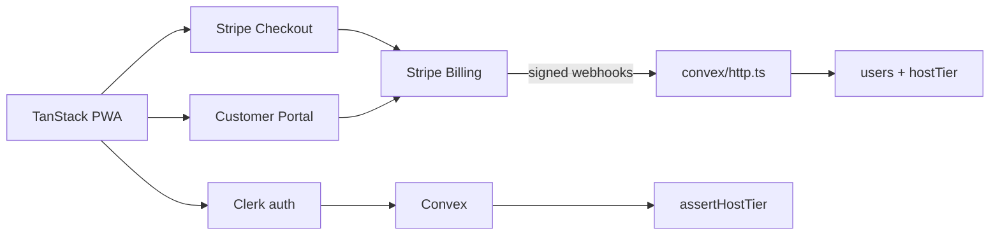

# Research: Stripe Billing + Clerk auth for EUR and 3DS

> **Decision:** This is the Host Pro stack — [ADR 0003](../docs/adr/0003-stripe-billing-beside-clerk.md). Clerk remains auth only.

Part of wayfinder map [#132](https://github.com/HayGrouve/onova-za-smetkata/issues/132). Resolves [#133](https://github.com/HayGrouve/onova-za-smetkata/issues/133).

## Question

Can **Stripe Billing** (Checkout + Customer Portal + subscriptions) charge **Bulgarian then EU** Hosts in **EUR**, with **SCA/3DS** on first payment and renewals, while **Clerk remains the auth provider** and Convex remains the quota source of truth?

## Executive summary

**Yes — for a Bulgarian (or other EU) Stripe seller, this stack can charge Hosts in EUR and run SCA/3DS on first payment and on renewals that issuers still challenge.** Clerk Billing is a separate product from Clerk auth; dropping Billing does not require dropping Clerk or Convex. Quotas stay in `convex/lib/hostTier.ts`.

| Decision                     | Answer                                                                                                                                                                                                                                                                                                                     |
| ---------------------------- | -------------------------------------------------------------------------------------------------------------------------------------------------------------------------------------------------------------------------------------------------------------------------------------------------------------------------- |
| **BG/EU seller on Stripe**   | Supported market: localized BG pricing, BG payout IBANs, Stripe Tax business location `BG` ✓                                                                                                                                                                                                                               |
| **EUR prices (€2.99/mo)**    | Yes. Presentment currency `eur`; Stripe minimum **€0.50**. BG pricing is published in EUR (and BGN during euro transition).                                                                                                                                                                                                |
| **SCA/3DS first payment**    | Yes. Checkout is SCA-ready and **automatically handles 3DS**.                                                                                                                                                                                                                                                              |
| **SCA/3DS renewals**         | Yes, with integration work. Billing marks off-session charges as MIT after on-session setup; **exemptions are not guaranteed**. When the issuer demands 3DS, listen for `invoice.payment_action_required` and send the Host back to authenticate (Checkout/Portal/`confirmCardPayment`). Handle `incomplete` / `past_due`. |
| **Clerk stays auth**         | Yes. Official Convex integration is auth-only (`ClerkProvider` + `ConvexProviderWithClerk`). Clerk Billing is optional and **not** Stripe Billing.                                                                                                                                                                         |
| **Convex remains quota SoT** | Yes. Stripe (and Clerk) do not meter “5 bills / 5 OCR”. Mirror subscription state into `users` and keep `getEffectiveTier`.                                                                                                                                                                                                |
| **Tax**                      | Stripe Tax can calculate/collect EU VAT (BG seller and BG/EU customers supported). **Stripe Tax is not MoR.** MoR is a different product ([Managed Payments](https://docs.stripe.com/payments/managed-payments/tax-compliance)). Skipping Tax does not remove legal VAT duty.                                              |
| **Drop from Clerk Billing**  | `<PricingTable />`, `startCheckout`, `<SubscriptionDetailsButton />`, `has({ plan \| feature })` / JWT `pla`/`fea`, Clerk billing webhooks, and Clerk’s **0.7% billing-volume** add-on. Stripe Billing PAYG is **also 0.7%** of Billing volume (or a monthly Billing plan) **plus** card fees.                             |

Guest Revolut settlement is out of scope.

---

## 1. Stripe account eligibility (Bulgarian seller or other EU entity)

Stripe treats Bulgaria as a live payments market, not only a payout destination:

- Marketing and pricing are localized at [stripe.com/en-bg](https://stripe.com/en-bg) and [stripe.com/en-bg/billing](https://stripe.com/en-bg/billing).
- [BG pricing](https://stripe.com/en-bg/pricing): “Our pricing is available in both BGN and EUR while Bulgaria transitions to the Euro.” Card fees are quoted in EUR (e.g. **1.5% + €0.25** for standard EEA cards).
- [Payouts](https://docs.stripe.com/payouts): country **Bulgaria (BG)** uses a **22-character IBAN**; settlement timing is listed for Bulgaria (initial 7 calendar days, then 3 business days). That is the standard-account payout table, not only Connect cross-border recipients.
- [Stripe Tax supported countries](https://docs.stripe.com/tax/supported-countries): **BG** — product type All PTCs, tax type VAT, **your business location ✓**, **your customer location ✓**.
- [Managed Payments eligibility](https://docs.stripe.com/payments/managed-payments/eligibility) (separate MoR product) also lists **BG** under supported European business locations. That is extra confirmation Stripe onboards BG businesses; it is **not** required to use Billing.

**Practical implication:** a Host SaaS seller can open a **standard Stripe account** as a Bulgarian individual/company (or as another EU entity Stripe already supports — AT, DE, IE, …). The account country is the **seller’s** legal home, not the Host customer’s. Customers can be charged worldwide in supported presentment currencies; EEA cards (including **Bulgaria**) are explicitly in Stripe’s EEA-card list on [currencies](https://docs.stripe.com/currencies).

**Not claimed here:** exact KYC documents for a given legal form. Stripe collects those at onboarding via [country specs](https://docs.stripe.com/api/country_specs/object) / Dashboard. [Opening an account in another country](https://support.stripe.com/questions/requirements-to-open-a-stripe-account-in-another-country) is a separate Support article if the founder’s entity is not BG.

---

## 2. EUR prices and Checkout / Portal / subscriptions

### Prices

- Create a Product + recurring [Price](https://docs.stripe.com/api/prices/create) with `currency: 'eur'` and `recurring.interval: 'month'`. Amount in minor units: **299** = €2.99.
- [Minimum charge](https://docs.stripe.com/currencies#minimum-and-maximum-charge-amounts): **0.50 EUR**. €2.99 is above the floor. Zero-amount invoices are allowed for trials/coupons; any non-zero amount still meets the minimum.
- Presentment vs settlement: you can **present and charge in EUR** even if settlement later converts ([currencies](https://docs.stripe.com/currencies)). For a BG account already quoting EUR fees, EUR presentment + EUR/BGN payout is the intended path. If presentment ≠ card currency, the **customer’s issuer** may add FX; if presentment ≠ settlement, Stripe converts.

### Checkout (subscribe)

Stripe’s subscription build path is [Checkout `mode: 'subscription'`](https://docs.stripe.com/billing/subscriptions/build-subscriptions) plus a success URL. [Checkout Sessions](https://docs.stripe.com/payments/checkout-sessions) include subscriptions and **automatic 3DS**. Server creates the session (Convex `"use node"` action); Host is redirected. Attach `metadata` / `client_reference_id` with Convex `users` id / Clerk `sub` so webhooks can map the customer.

### Customer Portal

[Customer portal](https://docs.stripe.com/customer-management): Stripe-hosted self-serve for payment method, invoices, cancel, optional plan switch. Create `billingPortal.sessions` with `customer` + `return_url` **after** authenticating the Host in Clerk. Portal changes emit the same `customer.subscription.*` webhooks.

### Billing lifecycle (needed for `hostTier`)

From [How subscriptions work](https://docs.stripe.com/billing/subscriptions/overview):

| Stripe `status`       | Meaning for us                                                                               |
| --------------------- | -------------------------------------------------------------------------------------------- |
| `incomplete`          | First invoice unpaid or **3DS required**; 23h window then `incomplete_expired`               |
| `active`              | Provision Pro                                                                                |
| `past_due`            | Latest finalized invoice failed / not attempted; Smart Retries; maps to existing 7-day grace |
| `canceled`            | Terminal; keep Pro until `current_period_end` if cancel-at-period-end                        |
| `unpaid`              | Retries exhausted; revoke Pro                                                                |
| `trialing` / `paused` | Only if we add trials                                                                        |

---

## 3. SCA / 3DS — first payment and renewals

Stripe’s PSD2 page: [Strong Customer Authentication](https://docs.stripe.com/strong-customer-authentication).

**Who is in scope:** EEA-based business **or** EEA customers, paying by card. BG seller + BG/EU Hosts are in scope. Banks may still demand 3DS even when an exemption applies.

**SCA-ready products:** Checkout, Billing, Payment Intents / Setup Intents. Stripe says: _“For recurring payments, use Stripe Billing to manage subscriptions and invoicing.”_ Checkout _“automatically handles SCA requirements.”_

**First payment (on-session):**

- Hosted Checkout **manages 3DS** ([Checkout Sessions](https://docs.stripe.com/payments/checkout-sessions) — “Automatic authentication handling”).
- 3DS on standard Payments pricing is **included** ([BG pricing](https://stripe.com/en-bg/pricing)).
- If 3DS is required and not completed: PaymentIntent `requires_action`, subscription `incomplete`, invoice `open` ([subscription overview](https://docs.stripe.com/billing/subscriptions/overview#requires-action)).

**Saving the card for renewals:**

- Authenticate **on-session**, then reuse off-session. Setup Intents / Checkout with future usage let Stripe mark later charges as **merchant-initiated transactions (MIT)** and claim SCA exemptions ([SCA](https://docs.stripe.com/strong-customer-authentication), [Setup Intents](https://docs.stripe.com/payments/setup-intents)).
- You must show a **mandate** (permission, frequency, how amount is determined).
- **“Exemptions aren’t guaranteed, and off-session payments might still require authentication by the bank.”**

**Renewals (off-session):**

- Stripe automatically charges the default payment method.
- If the issuer requires 3DS: `invoice.payment_action_required`; you **notify the Host** and complete authentication (`confirmCardPayment` or send them to an invoice / Portal / Checkout flow).
- First invoice stuck on auth → `incomplete`. Later invoices → typically `past_due` after failure ([webhooks](https://docs.stripe.com/billing/subscriptions/webhooks)).
- Enable [Smart Retries](https://docs.stripe.com/billing/revenue-recovery/smart-retries) in Dashboard billing settings.
- Test with [regulatory 3DS cards](https://docs.stripe.com/testing#regulatory-cards) and [3DS authentication flow](https://docs.stripe.com/payments/3d-secure/authentication-flow).

This is the opposite of Clerk Billing, which **cannot prompt 3DS** and **fails** those payments ([Clerk Billing FAQ](https://clerk.com/docs/guides/billing/overview)).

---

## 4. Tax: Stripe Tax vs none

| Option                     | What Stripe’s docs say                                                                                                                                                                                                                                                                                                                                                                         | Fit for €2.99 B2C Hosts                                                                               |
| -------------------------- | ---------------------------------------------------------------------------------------------------------------------------------------------------------------------------------------------------------------------------------------------------------------------------------------------------------------------------------------------------------------------------------------------- | ----------------------------------------------------------------------------------------------------- |
| **Stripe Tax**             | Calculates VAT/GST from business address, registrations, product tax codes, customer location. Enable `automatic_tax` on Checkout / subscriptions. You still **register, file, and remit**. ([How Tax works](https://docs.stripe.com/tax/how-tax-works), [Tax on subscriptions](https://docs.stripe.com/tax/subscriptions), [Checkout taxes](https://docs.stripe.com/payments/checkout/taxes)) | Recommended if we stay merchant of record. BG + EU customers supported.                               |
| **No Stripe Tax**          | Checkout/Billing still charge the Price as-is. Stripe does **not** become your tax advisor or remove VAT law.                                                                                                                                                                                                                                                                                  | Possible for a short “no VAT in spec” period; **compliance gap stays on us** (same as Clerk Billing). |
| **Managed Payments (MoR)** | Stripe is MoR for digital goods: tax, fraud, disputes, support. Extra **3.5%** on top of Payments ([BG pricing](https://stripe.com/en-bg/pricing), [Checkout taxes callout](https://docs.stripe.com/payments/checkout/taxes)).                                                                                                                                                                 | Different product; compare in [#134](https://github.com/HayGrouve/onova-za-smetkata/issues/134).      |

EU VAT specifics for Bulgaria: [Collect tax — Bulgaria](https://docs.stripe.com/tax/supported-countries/european-union/collect-tax?tax-jurisdiction-european-union=bulgaria) — VAT, all PTCs, business and customer location supported, NRA registration / OSS links, **registration threshold: 1 transaction** in Stripe’s table (treat as “check NRA/OSS”, not legal advice).

Stripe Tax only collects where you have an **active registration** in the Dashboard. Missing customer location → `invoice.finalization_failed` / `automatic_tax[status]=requires_location_inputs`.

**Inclusive vs exclusive:** set Price `tax_behavior`. For advertised **€2.99/мес.**, inclusive VAT keeps the sticker price stable; exclusive adds VAT on top (UX/legal copy must match).

---

## 5. Webhooks → `users` billing fields / `hostTier`

Authoritative enforcement today (`convex/lib/hostTier.ts`):

- Pro if `clerkPlanSlug === 'pro'` and (`subscriptionStatus === 'active'` **or** `canceled` with `now < currentPeriodEnd`)
- Pro during `past_due` if `now < graceUntil` (7 days)
- Else free

Stripe does not know `clerkPlanSlug`. Mirror Stripe → the same fields (optionally rename `clerkPlanSlug` later to `planSlug`; not required for a first cut). Store **`stripeCustomerId`** (and subscription id) on `users` for Portal and idempotency. Keep `processedWebhookEvents` (already in schema).

Subscribe at minimum ([subscription webhooks](https://docs.stripe.com/billing/subscriptions/webhooks)):

| Stripe event                      | Suggested Convex patch                                                                                                       |
| --------------------------------- | ---------------------------------------------------------------------------------------------------------------------------- |
| `checkout.session.completed`      | Link `customer` → `users.stripeCustomerId`; do **not** grant Pro until paid                                                  |
| `customer.subscription.created`   | May be `incomplete` — do not treat as Pro                                                                                    |
| `invoice.paid`                    | If subscription `active`: `clerkPlanSlug: 'pro'`, `subscriptionStatus: 'active'`, set `currentPeriodEnd`, clear `graceUntil` |
| `customer.subscription.updated`   | Sync status, period end, cancel-at-period-end; renewals fire this event                                                      |
| `invoice.payment_failed`          | First invoice → stay incomplete / no Pro. Renewal → `past_due`, `graceUntil: now + 7d`                                       |
| `invoice.payment_action_required` | Same as failed for access **plus** notify Host to complete 3DS                                                               |
| `customer.subscription.deleted`   | `canceled` or clear plan; revoke when period ends / immediately if already ended                                             |
| `invoice.upcoming`                | Optional reminder; not a tier change                                                                                         |

Verify signatures ([webhooks](https://docs.stripe.com/webhooks#verify-events)). Provision on **`invoice.paid` + `active`**, not on `checkout.session.completed` alone (async / 3DS).

Clerk user webhooks (`user.created` / `updated`) stay for identity sync. **Stop** depending on Clerk `subscriptionItem.*` for tier.

---

## 6. Clerk remains auth — what we drop from Clerk Billing

Clerk documents Billing as **optional and separate**:

- [Clerk Billing overview](https://clerk.com/docs/guides/billing/overview): Stripe is used **only for payment processing**; **Plans/Subscriptions are not synced to Stripe Billing**.
- [Convex integration](https://clerk.com/docs/guides/development/integrations/databases/convex): session JWT + `ConvexProviderWithClerk` + `ctx.auth.getUserIdentity()`. **No Billing step.**
- Auth features (sign-in, session tokens, Convex `aud` claim) do not require enabling Billing.

**Drop (Clerk Billing-only):**

| Piece                                      | Official source                                                                                                                                                      | Replacement                                                                                   |
| ------------------------------------------ | -------------------------------------------------------------------------------------------------------------------------------------------------------------------- | --------------------------------------------------------------------------------------------- |
| `<PricingTable />`                         | [TanStack B2C Billing](https://clerk.com/docs/tanstack-react-start/guides/billing/for-b2c)                                                                           | Own BG paywall + redirect to Checkout                                                         |
| `clerk.billing.startCheckout`              | same + custom-checkout guides                                                                                                                                        | Convex action → Checkout Session                                                              |
| `<SubscriptionDetailsButton />`            | Clerk Billing components                                                                                                                                             | Portal session URL                                                                            |
| `has({ plan })` / `<Show when={{ plan }}>` | [B2C Billing](https://clerk.com/docs/tanstack-react-start/guides/billing/for-b2c), [authorization checks](https://clerk.com/docs/guides/secure/authorization-checks) | `getEffectiveTier` in Convex (already SoT)                                                    |
| JWT `pla` / `fea`                          | [Session tokens](https://clerk.com/docs/guides/sessions/session-tokens)                                                                                              | Ignore for quotas; optional later if you write Stripe status into Clerk metadata (not needed) |
| Clerk billing webhooks                     | [Billing webhooks](https://clerk.com/docs/guides/development/webhooks/billing)                                                                                       | Stripe events above                                                                           |
| Clerk Billing **0.7%**                     | [Clerk pricing](https://clerk.com/pricing) — “0.7% of billing volume (on top of Stripe's 2.9% + $0.30)”                                                              | See fees below                                                                                |

**Keep:** Clerk auth, localization, Convex JWT, Host `requireAuth` / `clerkSubject`.

Clerk Billing constraints this move **fixes**: USD-only; **no 3DS** (payments that need 3DS **fail**, including background renewals); no VAT ([overview FAQ](https://clerk.com/docs/guides/billing/overview)). Bulgaria is **not** on Clerk’s restricted Billing country list (BR, IN, MY, MX, SG, TH).

---

## 7. Fees (do not assume we “save 0.7%”)

Clerk markets Billing as “the same as using Stripe Billing directly, just **0.7%** per transaction, plus Stripe fees” ([B2C Billing](https://clerk.com/docs/tanstack-react-start/guides/billing/for-b2c), [Clerk pricing](https://clerk.com/pricing)).

[Stripe BG pricing](https://stripe.com/en-bg/pricing) for **Billing** PAYG: **0.7% of Billing volume** (or a monthly Billing subscription, from €588/mo). **Payments** (EEA standard cards): **1.5% + €0.25**. 3DS included on standard Payments.

So leaving Clerk Billing:

- Removes **Clerk’s** 0.7% overlay (and USD/3DS blockers).
- Adds **Stripe Billing’s** 0.7% PAYG (or the monthly plan) **unless** volume is billed only as Payments without the Billing product — Stripe’s page prices Billing as a distinct product for subscriptions.
- Card processing remains Stripe’s, in **EUR**, not Clerk’s US-centric “2.9% + $0.30” example.

Checkout itself is included with Payments; custom domain for Checkout/Portal is listed as **US$10/mo**.

---

## 8. Architecture (auth + billing split)

1. Host signed in with Clerk (`sub` → `users.clerkSubject`).
2. Authenticated Convex action creates/reuses Stripe Customer, Checkout Session `mode: 'subscription'`, EUR Price, `success_url` back to the PWA.
3. Stripe webhooks update `subscriptionStatus` / period / grace.
4. Mutations keep calling `getEffectiveTier` — never `has({ plan })` as SoT.

This is Approach B from `research/auth-billing-alternatives.md`, with the stale “still on Convex Auth” baseline updated: **auth migration to Clerk is already done**.

---

## 9. Gaps this ticket does not close

- **VAT registration / OSS / invoices** — legal, not a Stripe API yes/no. Stripe Tax helps calculate; we still register and file. MoR comparison is [#134](https://github.com/HayGrouve/onova-za-smetkata/issues/134).
- **Exact Dashboard KYC** for a specific EIK / sole trader — completed in Stripe onboarding, not in these docs.
- **Dunning copy** in Bulgarian and whether grace stays 7 days when Smart Retries overlap.
- **Whether €2.99 is VAT-inclusive** once Tax is on.
- **Clerk + non-Clerk payments coupling** — [#136](https://github.com/HayGrouve/onova-za-smetkata/issues/136) (this research found **no** first-party block).

---

## Sources

Stripe (docs / first-party pricing):

- [Strong Customer Authentication](https://docs.stripe.com/strong-customer-authentication)
- [3D Secure authentication flow](https://docs.stripe.com/payments/3d-secure/authentication-flow)
- [Checkout Sessions API](https://docs.stripe.com/payments/checkout-sessions)
- [Build subscriptions (Checkout)](https://docs.stripe.com/billing/subscriptions/build-subscriptions)
- [How subscriptions work](https://docs.stripe.com/billing/subscriptions/overview)
- [Subscription webhooks](https://docs.stripe.com/billing/subscriptions/webhooks)
- [Customer management / portal](https://docs.stripe.com/customer-management)
- [Supported currencies](https://docs.stripe.com/currencies)
- [Payouts (Bulgaria IBAN / settlement)](https://docs.stripe.com/payouts)
- [Stripe Tax](https://docs.stripe.com/tax) · [How Tax works](https://docs.stripe.com/tax/how-tax-works) · [Tax on subscriptions](https://docs.stripe.com/tax/subscriptions) · [Checkout taxes](https://docs.stripe.com/payments/checkout/taxes)
- [Tax supported countries](https://docs.stripe.com/tax/supported-countries) · [EU / Bulgaria](https://docs.stripe.com/tax/supported-countries/european-union/collect-tax?tax-jurisdiction-european-union=bulgaria)
- [Managed Payments eligibility](https://docs.stripe.com/payments/managed-payments/eligibility)
- [Setup Intents (off-session / SCA)](https://docs.stripe.com/payments/setup-intents)
- [Prices API](https://docs.stripe.com/api/prices/create)
- [stripe.com/en-bg](https://stripe.com/en-bg) · [Billing](https://stripe.com/en-bg/billing) · [Pricing](https://stripe.com/en-bg/pricing)

Clerk:

- [Billing overview (USD, no 3DS, no VAT, not Stripe Billing)](https://clerk.com/docs/guides/billing/overview)
- [Billing for B2C (TanStack) — PricingTable, has(), 0.7%](https://clerk.com/docs/tanstack-react-start/guides/billing/for-b2c)
- [Authorization checks](https://clerk.com/docs/guides/secure/authorization-checks)
- [Session tokens (`pla`, `fea`)](https://clerk.com/docs/guides/sessions/session-tokens)
- [Convex integration](https://clerk.com/docs/guides/development/integrations/databases/convex)
- [Clerk pricing (Billing 0.7%)](https://clerk.com/pricing)

Repo context (not vendor SoT): `research/clerk-billing-platform-constraints.md`, `convex/lib/hostTier.ts`, `convex/schema.ts` `users` billing fields.

---

## Recommendation

Use **Clerk for Host auth only** and **Stripe Billing** (hosted Checkout + Customer Portal + signed webhooks into Convex) as the Host Pro collector: a Bulgarian or other EU Stripe account can price **€2.99/mo in EUR**, Checkout will run **3DS on the first charge**, and Billing can complete **renewal 3DS** when issuers refuse the MIT exemption — provided we handle `invoice.payment_action_required` and map `active` / `past_due` / `canceled` onto the existing `hostTier` grace rules. Do **not** keep Clerk `<PricingTable />` / `has({ plan })` as source of truth. Budget **Stripe Billing 0.7% PAYG (or the monthly Billing plan) plus EEA card fees**, not a fee-free escape from Clerk’s 0.7%. Turn on **Stripe Tax** (VAT-inclusive €2.99, customer address, BG/OSS registrations) unless grilling chooses a MoR instead; “no Tax” only repeats the current VAT gap. Guest Revolut stays untouched. Decide vs Paddle/Lemon/Polar and Mollie/Adyen in [#134](https://github.com/HayGrouve/onova-za-smetkata/issues/134)–[#137](https://github.com/HayGrouve/onova-za-smetkata/issues/137) before implementing.
